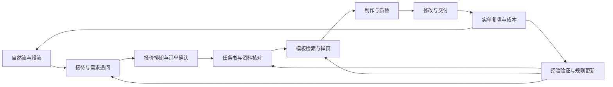

# 闲鱼 PPT 获客、制作与经验成长系统｜统一执行计划书

> 版本：v1.4｜更新日期：2026-09-13｜当前阶段：制作标准纠偏与网页样稿合同已接入，真实样稿与成本待验证。
> 本文是后续执行顺序、任务状态和验收记录的唯一主入口。此前设计稿与专题报告保留为背景和证据，不再维护并行执行清单。
> 跨会话接力：代码与计划进入GitHub仓库（2026-09-13已按用户要求公开）；先读[当前进度](./CURRENT_STATE.md)及[接手方法](./docs/仓库交接.md)。原始订单、消息、PPT、模板索引与密钥继续留在本地，不随仓库克隆。
> 已完成：素材库元数据盘点、本地索引、基础命名检索测试、知识库定向检查；已登记武汉朴里节真实制作案例，用户确认制作完成，总价100元、已收30元、待收70元。尚未完成：本系统统一制作链路验收、成本实测、下一单经验验证、消息接待与投流联动。历史制作成果不等于这些模块已自动化。

**建设顺序：先跑通一单可编辑 PPT 的制作、修改和交付，在做单时记录经验；再减少人工时间；最后连接接待、报价与投流。**

**2026-09-08实施结果：**本目录已成为专用工作区，提供[使用入口](./README.md)、工作台和工作区文件。已实现本地订单工具、资料快照与解析缓存、事实/缺项表、受限上下文任务包、PPTX文本填充适配器、版本与审核绑定、样稿打包及经验记录。独立演示订单跑出了两版5页PPT和一份样稿包；详见[最小闭环验收](./reports/最小闭环验收.md)。当前语义理解和看图由本任务中的Codex完成，没有独立后台模型服务。真实武汉订单继续保持总价100元、已收30元、待收70元。

## 1. 目标、现状和执行约定

**2026-09-12当前进度：**已接入本机微信私聊只读读取器，定位“黄已经”并导出52条可索引消息，四份相关附件已快照。依据现存最终修改版和《修改.docx》完成两份22页内部样稿，审核、打包并保存4条候选经验。价格路由器进入订单和任务包，29项测试通过。详见[路线说明](./双路线制作说明.md)和[新旧对比](./reports/黄已经双路线重制对比.md)。用户已取消额度暂停规则。下一步用真实新单验证人工耗时和返工；原教案、截图、引文与动画要求仍有缺项。此次接入不是实时消息接待。

### 1.1 要建成的整体



获客与制作共用订单、需求、报价和版本数据。第一阶段由本人沟通和录入需求，制作工具先独立运行；未来自动接待输出同样的任务书，无需重建制作链路。

第一版是自用半自动系统：AI 承担整理、检索、生成和明确修改；本人确认复杂需求、样页、最终质量与业务例外。任意订单全程无人审核不作为首版目标。

### 1.2 已知经营情况

| 项目 | 当前依据 | 执行含义 |
|---|---|---|
| 现有业务 | 已在闲鱼做 PPT，手头有少量自有作品与话术 | 用实际材料试制，不先构建假想业务 |
| 自然流量 | 用户此前描述最近几天约 1 单 | 是阶段情况，不推算长期日均 |
| 投流经验 | 用户描述一次投流 70 元带来 6–7 单，客户成本约 10 元 | 后续分清咨询、付款、验收未退款；不假定扩大预算后成本不变 |
| 简单制作 | 1–2 元/页 | 重点约束资料完整度、工作范围和人工投入 |
| 精美制作 | 4–6 元/页 | 用真实样例界定质量，作为可考虑的首批验证档位 |
| 定制制作 | 10 元/页及以上，用户目前实际最高约 10 元/页 | 更高档位未验证成交，不把他人价格当自己的能力 |
| 最大制作瓶颈 | 反复修改 | 需求、样页、局部修改和版本管理必须进入最小闭环 |
| 接待瓶颈 | 本人不能实时回复 | 后期必须验证离线有效接待，回复草稿功能不能代替 |
| 当前优先级 | 先制作部分 | 暂不依赖闲鱼平台接入，也不先扩大投流 |

所有价格均为页单价，实际客单价取决于页数和工作范围。经营数字来源于用户前序描述，不是平台后台审计结果。

### 1.3 素材库实测，替代原先 90G 的估计

扫描日期为 2026-09-06，扫描根目录为 `E:\BaiduNetdiskDownload\国赛PPT高端精品`。

| 资源 | 已核实数据 | 使用办法 |
|---|---|---|
| 全部可见文件 | 36,128 个、235.845 GB，约 219.648 GiB | 是逻辑大小；不每单扫描全部内容 |
| PPTX | 2,444 个 | 主要候选池，内容质量和可编辑性待检 |
| 旧 PPT | 2,398 个 | 按需要在副本转换，不先批量转换 |
| PPT/PPTX 合计 | 4,842 个，约 71.55 GB／66.64 GiB | 不把视频、字体、文档都交模型判断模板 |
| 首批候选 | 344 个 PPT/PPTX，其中 343 个 PPTX | 优先查看下表四个目录 |
| 疑似重复 | 全格式共 10,501 组同名同大小候选 | 未算内容哈希，不能直接认定重复或据此删文件 |
| 下载状态 | 扫描时有 2 个 `.downloading` 文件 | 后续核对相关文件；不能把本次统计当全包完整性验收 |

| 首批目录 | PPT/PPTX 数量 |
|---|---:|
| 创赛精选PPT | 104 |
| 创赛精选PPT【2025年4月更新】 | 96 |
| 创赛精选PPT【2025年9月更新】 | 49 |
| 最近更新 | 95 |

资料从命名看偏创赛、创业路演与教学，不能假定覆盖所有客户。压缩包尚未展开；“高端”“精选”等名称不是质量或商用授权证明。原库保持原位置，工作使用副本。

### 1.4 已有工具和证据

- [模板盘点报告](./reports/模板盘点_2026-09-06/模板盘点报告.md)：数量、格式、目录与检索结果。
- [本地索引数据库](./reports/模板盘点_2026-09-06/template_inventory.sqlite)：文件路径、名称、格式、大小和修改时间。
- [盘点工具](./tools/inventory_templates.py)：只读扫描原库，当前重新运行会全量刷新元数据快照；尚非正文增量分析系统。
- [检索工具](./tools/search_templates.py)：按目录名和文件名匹配，默认返回 5 条、最多 20 条。
- 已测试“医疗＋蓝色”“乡村振兴＋农业”“汽车＋科技”，可以定位相关候选。测试只验证命名匹配，未验证视觉效果。
- 现有检索为全 PPT/PPTX 池加精选目录优先排序，尚未实现“严格先搜 344 份、不足再扩大”的两阶段检索，这属于 E05 待办。

### 1.5 一步步执行的规则

1. 按第 2 节推进，已完成工作复用现有产物，不重复从零实施。
2. 一步完成的依据是可检查产物和验收记录，计划写完不等于系统建完。
3. 开始前只补本步必要输入，不要求本人先整理全部历史、所有知识或整个素材库。
4. 缺客户资料时继续独立的环境核查、候选检索、规则整理；依赖真实确认的动作保持待确认。
5. 实施时发现规模、工具或需求变化，更新本计划和记录，不另开一份平行主计划。
6. 日程按依赖和结果推进。工期、费用在本步输入明确后估算，不凭空承诺整体天数。
7. 本文是建设计划，不代表已经授权未来的客户消息发送、投流付款、工具采购或定时任务创建；具体实施遵循届时已获得的授权范围。

## 2. 唯一执行清单和当前起点

状态：已完成＝有证据；部分完成＝存在产物但未通过完整验收；待输入＝本人需要提供关键业务事实；待实施＝依赖满足后执行。

| 步骤 | 工作 | 状态 | 主要依赖 | 完成后得到什么 |
|---|---|---|---|---|
| E01 | 盘点素材并建立基础索引 | 已完成 | 已提供目录 | 可查询元数据及报告 |
| E02 | 整理知识库与当前业务规则 | 部分完成 | 已检查知识库；本人补规则 | 可供生产读取的精简规则 |
| E03 | 选择第一单并建立订单档案 | 部分完成 | 已登记武汉朴里节；最终交付版本和工时待补 | 可执行任务书、原始资料及基线 |
| E04 | 验证制作环境与候选技术路线 | 部分完成 | 已验证PPTX文本填充/导出/渲染；原生软件兼容待验 | 能编辑、保存和渲染的最小能力 |
| E05 | 检索候选并按需生成预览 | 部分完成 | E03；预览依赖 E04 | 对标卡片和可比较代表页 |
| E06 | 确认质量档位并整理生产模板 | 部分完成 | 已接入可配置价格双路线；教学模板两个分支待真实客户验证 | 一份可稳定填充的模板 |
| E07 | 完成逐页大纲和代表样页 | 部分完成 | 黄已经22页共用文案和双路线样稿完成；新客户样页确认待验证 | 确认过的结构和风格 |
| E08 | 生成第一版可编辑全稿 | 部分完成 | 两份22页历史全稿已制作、登记；真实新单待验证 | PPTX、预览、内容来源 |
| E09 | 检查质量和目标软件兼容性 | 部分完成 | 演示结构、文字和预览已检；客户软件未验 | 问题报告与修复版本 |
| E10 | 完成一次真实局部改稿 | 部分完成 | 历史资料回放的局部改稿已跑通；新客户反馈待验 | 新版本、变更摘要、回滚能力 |
| E11 | 交付并算清这一单成本 | 部分完成 | 武汉朴里节制作完成，待收70元；最终发送版本与成本待补 | 交付档案、人工用时与收益 |
| E12 | 让本单经验改变下一次动作 | 部分完成 | 已提取7条候选；尚未在下一单验证 | 一条可验证、可撤回的改进 |
| E13 | 多单复用和成本优化 | 部分完成 | 已有双路线、共用文案、网页工程委派实跑；真实工时与Token节省未测 | 有实测边界的制作工作流 |
| E14 | 统一套餐、作品展示和报价排期 | 待实施 | E02、E13 的实际数据 | 接待可使用的产品和产能规则 |
| E15 | 验证闲鱼消息接入及可靠性 | 待实施 | 账户实际能力及适用方式 | 可用入口，或明确的半自动边界 |
| E16 | 历史聊天回放和回复影子运行 | 待实施 | E14；在线影子另依赖 E15 | 经测试的接待策略和转人工队列 |
| E17 | 有限自动接待连接制作队列 | 待实施 | E15、E16、对应启用授权 | 不在线时收需求，关键步骤人工接管 |
| E18 | 连接自然流、投流与经营复盘 | 待实施 | E13、E14、E17 或真实人工承接能力 | 按收益和产能决定是否扩量 |

**当前工作区已可接下一单验证。**E01不重做；客户指定模板时跳过E05的素材库检索。E04、E07—E10已部分完成演示验证，接下来用真实新单检验人工分钟、客户改稿和最终验收。制作内容超出文本替换适配器时，按Presentations技能在订单目录制作并通过register接回，避免为追求自动化而降低交付质量。

### 2.1 当前只需要本人先提供

已提供首单：[武汉朴里节案例复盘](./orders/XY-PPT-20260904-001/案例复盘.md)。2026-09-07本人确认制作完成、总价100元、尚余70元，计划次日自行提醒客户。剩余收款不阻塞经验提取或下一单验证。

本单下一次只需补：最终实际发给客户的文件，以及大约人工用时；收到尾款后更新收款状态。以下表单留给下一单使用，不要求重新提交本单全部资料。

```text
第一份试做需求及材料所在位置：
用途、大约页数、最晚时间：
客户给的是定稿文案，还是需要整理内容：
预期价格档位与参考效果：
交付是否必须可编辑，主要用 WPS 还是 PowerPoint：
如是历史单：首稿、修改意见、终稿是否还能找到：
```

先一单即可。不必凑齐 3 单才开始；后续逐步加入顺利单、多轮修改单、低价耗时或失败单。暂无真实订单时，可以做明确标注的演示单验证技术，但不能据此证明实际成交或客户满意。

## 3. 第一阶段：制作准备（E01–E06）

### E01｜素材盘点与基础索引——已完成

**已做：**扫描文件元数据，建立 SQLite 数据库，统计格式、目录和同名同大小候选，完成三组命名检索。证据见第 1.4 节。

**不重复做：**逐份上传模型、全量渲染、全库解压、安装所有字体、自动删除疑似重复文件。

**后续维护：**新增资料后再更新索引；需要确证重复时单独安排内容哈希；目录改名或文件变化时避免命中旧预览。先保留缓存键所需字段，增量处理在 E13 完善。

**完成边界：**本步完成不表示已有视觉检索、可编辑性验证或生产模板库。

### E02｜将知识库资料变成当前业务规则——部分完成

**现状：**2026-09-06 定向检查 `E:\知识库`，闲鱼专题 37 个内容页，加索引和日志共 39 个文件；未做全库来源和工具运行状态审计。

**本人补充：**当前价格、内容整理范围、修改边界、加急处理、可工作时段；不确定项保持待定。

**具体动作：**

1. 复用谈单五要素、按工作量报价、样页确认、交付留痕、复盘五问。
2. 把“本人当前已确认规则”“他人经验”“历史工具评价”“待验证假设”分开。
3. 群聊高价不覆盖本人实际报价；“必须先生图再转 PPT”等旧结论仅作技术候选。
4. 为每条可执行规则记录编号、来源、日期、场景、触发条件、动作和本人确认状态。
5. 从少量相关页面生成精简配置；不把全部 37 篇或完整伤疤档案塞进每单上下文。
6. 原知识页本次不必重写；正式入库和更新按 E12 的来源、锁、体检规则执行。

**计划产物：**`config/business_rules.json`、`knowledge/业务规则来源映射.md`。路径均相对本项目，是待创建产物。

**验收：**系统可说清本单适用哪些规则；未知价格和承诺不会自动补造；冲突不会被静默覆盖。规则映射完成才算本步完成，仅检查过知识库不算。

### E03｜第一单任务书、档案和实测基线——部分完成

**2026-09-07进展：**已创建`orders/XY-PPT-20260904-001/`，包含任务书、事件记录、成本表、证据指纹与阶段复盘。制作完成与金额根据本人本轮确认；最终发出文件及历史人工工时仍待补，不虚构完整基线。

**输入：**第 2.1 节材料，优先选择有完整文稿、风格较明确、无复杂动画的实际需求。

**具体动作：**

1. 创建唯一 `order_id`，将原始材料只读保留，工作在副本进行。
2. 提取用途、受众、页数、文案责任、资料来源、风格、时间、格式和目标软件。
3. 每项标记已确认、推断、待确认；列出信息缺口和彼此冲突的要求。
4. 明确页数是否含封面目录、客户数据是否可改、是否包含图表重绘、演讲稿和动画。
5. 只追问会影响本步决策的缺项；有参考图时说明具体借鉴什么。
6. 建立阶段计时和费用记录。历史用时不清记为估计；现场人工计时与模型等待时间分开。
7. 开始记录需求变化、模板选择、样页反馈与版本事件，给 E12 留证据。

**计划产物：**`orders/订单编号/brief.json`、`inputs/`、`events.jsonl`、`metrics.json`。

**本人负责：**提供真实需求和客户事实，确认本单工作范围；不需要自己把材料整理成程序格式。

**验收：**任务书足以指导选款和开工，关键未知可见，资料和订单不会混淆。

### E04｜制作与渲染环境的小样验证

**输入：**可用本机软件与授权范围、一份候选模板副本、目标交付软件。环境只读检查可先做，不必等全部历史案例。

**具体动作：**

1. 检查可用的 PowerPoint/WPS、程序库、渲染器、字体及输出空间；只安装或调用实际需要的资源。
2. 以“模板填充”为首个假设，必要时比较“直接生成可编辑页”“生图后转换”，不先要求三条路线都开发完整。
3. 用同一小样验证：换中文标题、长正文、图片裁剪、必要图表数据、复制页面、单元素修改。
4. 保存后重新打开和渲染，检查母版、图片、图表、字体与可编辑性。
5. 记录各路线人工分钟、可得调用费用、失败情况和一次局部改稿的难度。
6. 选择能满足该场景的路线；不支持的结构换模板、降级或人工处理，限制重复尝试次数。

**计划产物：**`reports/制作环境与路线验证.md`、隔离的小样文件、可复现执行命令。

**验收：**可在目标软件中打开、编辑、保存和渲染；未能验证的客户端版本明确标记。不会无损编辑所有 PPT 不构成无限追加开发的理由。

### E05｜需求检索与少量候选预览——已有基础，待补视觉

**输入：**任务书、现有数据库、E04 可用渲染路线。

**具体动作：**

1. 将需求拆成用途、行业、风格、颜色、内容密度、图表、画幅和可编辑要求。
2. 在现有命名检索上补首批 344 份的范围过滤；不足时再扩展到 4,842 份。
3. 做本地同义词、别名与噪声处理，原始名称和路径仍保留；不必先建向量数据库。
4. 先返回 5–8 张短卡片；只给最相关的 2–3 份生成代表页预览。
5. 预览包含封面、信息密集页及图表/流程页，不能仅凭封面选款。
6. 按需补视觉标签、文字容量和不适用场景；记录淘汰原因。
7. 缓存与文件内容版本、渲染器版本关联；小卡片标记来源与授权状态。

**计划产物：**候选卡片、`previews/`、订单内 `template_selection.json`。

**验收：**本人能判断候选是否适合本单，选择理由与实际页面一致；能说清哪些没看、为什么没选。库存容量增大不导致每单自动扩大模型输入。

### E06｜质量档位与生产模板

**输入：**选中候选、目标软件验证、实际售价范围；本人代表作品有多少先用多少。

**具体动作：**

1. 本人用代表页说明“这个档位可以卖”“这个不够”和关键理由；补配色、层级、密度、图表和内容整理标准。
2. 首次先整理一份能完成试单的模板，逐步扩展 3–5 套；不以数量代替可用性。
3. 为标题、正文、图片、图表等替换目标建立稳定标识，记录版式容量与字体。
4. 整理封面、图文、对比、时间线、数据、流程等实际需要的组件；尽量在同一主题内复用。
5. 记录来源和允许使用的范围，生产前核实；案例参考文件不自动等于可直接商用交付的模板。
6. 短文、长文和实际内容试填；超容量则精简、换版式或提出拆页，不能无限缩字号。

**计划产物：**`production_templates/模板编号/`、`template_manifest.json`、分档质量对照。

**验收：**本单必要元素可编辑，试填稳定，适用和不适用范围明确。首批候选目录中的全部 344 份不必变成生产模板。

## 4. 第二阶段：跑通第一单（E07–E11）

### E07｜逐页大纲和样页确认

**输入：**任务书、生产模板、客户内容与参考。

**具体动作：**

1. 形成章节顺序与核心结论，为每页建立稳定页面 ID、标题、要点、来源、版式和素材需求。
2. 对资料数字、名称和关键原文保留来源；数据缺失标待补，不编造业绩或案例。
3. 对照页数与容量；需要增加收费页数时先确认，不静默拆页。
4. 纯排版单优先保留已确认文案；内容策划单由本人先审结构。
5. 简单单可以固定样例选款；精美或定制单制作代表样页，至少包含实际内页。
6. 先由本人审，再按实际交易约定请客户确认方向，保存真实确认记录。
7. 风格未确定时避免展开全稿。历史回放可以用历史证据代替现场反馈，但须标记为回放。

**计划产物：**`outline.json`、样页文件、`confirmations/`。

**验收：**结构覆盖需求，视觉方向和密度明确。样页确认不表示全稿错误被免责；付款与样页先后依平台支持和约定配置。

### E08｜可编辑全稿

**具体动作：**

1. 在工作副本复制已验证的页面，维护布局、母版、图片、图表等关系。
2. 模型给结构化内容和编辑意图，本地程序校验目标、长度和数据后执行。
3. 按页填充文字、图片和数据；统一色板、字号层级、页码和画幅。
4. 每页关联原模板、素材和数据来源；复杂页交本人或进入单独设计步骤。
5. 整页图片不默认当作可编辑交付；客户确实接受时记录适用形式。
6. 保存 `v001`，生成实际成品预览；失败保存中间状态，有限重试。

**计划产物：**`versions/v001/deck.pptx`、预览、逐页记录与制作日志。

**验收：**约定文字和图表可编辑、内容完整、文件可打开；第一稿生成成功后仍必须经过 E09。

### E09｜结构、视觉、业务和兼容性检查

| 检查层 | 具体检查 | 承担者 |
|---|---|---|
| 程序 | 文件可读、页数、缺图、占位符、空白页、越界、字体依赖 | 本地规则，不能宣称覆盖所有视觉错误 |
| 视觉 | 遮挡、断行、密度、对齐、层级、图表可读性与风格一致 | 实际渲染＋模型检查，疑点交本人 |
| 业务 | 客户名、关键数字、不可改原文、内容覆盖、交付格式 | 对照来源，本人核实关键项 |
| 兼容性 | 客户目标软件打开、编辑、字体和动画效果 | 目标客户端实测；无法验证时注明 |

**执行：**生成带页面 ID、位置、严重程度和修复建议的问题单；修复后复查。全局主题或字体变化重查全稿；局部修改重点检查相关页及关联影响。

**阻断交付：**打不开、错客户、关键数据错误、缺必需内容、重大遮挡、承诺可编辑但不可编辑、示例数据残留。

**计划产物：**`qa_report.json`、修复记录和更新预览。

**验收：**阻断问题清除，本人确认达到本单质量标准。不能仅凭 AI 自评分通过，也不能把模板预览代替成品检查。

### E10｜局部修改与版本恢复

**输入：**客户意见、当前版本、确认记录。优先用真实反馈验证；无修改订单可另用历史修改样本验证工具，不虚构客户不满。

| 修改类型 | 处理 |
|---|---|
| 制作错误 | 纠正，不用“次数用完”拒绝合理纠错 |
| 范围内调整 | 按接单前约定执行 |
| 新增页数、材料或改方向 | 本人确认新增工作及交期，必要时修订报价 |
| “不高级”等模糊意见 | 先澄清具体问题及参考，不立即全稿重做 |

**具体动作：**

1. 合并本轮零散意见，识别矛盾、撤回和已经处理的内容。
2. 绑定基础版本、稳定页面 ID 和目标元素，当前页码只作为显示。
3. 在副本执行明确的局部修改，保留已确认内容。
4. 客户发回自己改过的文件时先识别新版本、比对结构，不在旧稿上覆盖。
5. 保存 `v002` 等版本、改动摘要和未完成项；检查受影响页面及页码关系。
6. 记录修改原因和人工分钟，本人补一句关键判断，供 E12 使用。

**计划产物：**`changes/`、新版本、变更摘要、可恢复的旧版本。

**验收：**修改目标正确，无关内容没有非预期变化；可以恢复；需求变化不会被静默认定免费制作。

### E11｜交付、验收、成本与归档

**具体动作：**

1. 核对订单、收件对象、版本、格式、约定付款状态和未解决事项。
2. 准备 PPTX、约定的 PDF/预览和必要说明；不随包传播无许可的字体或素材。
3. 清除模板样例内容、内部备注、无关隐藏页和其他客户信息，保留客户需要的备注。
4. 固定交付版本和哈希，由本人按约定方式发送；记录发送与验收为不同状态。
5. 归档原需求、首稿、修改意见、终稿、反馈及费用；无回复不能自动记作满意。
6. 计算首单贡献和人工时间。授权展示且已脱敏的内容才进入作品集。
7. 保存期、备份和删除范围待本人确认后配置，原始资料不只放缓存。

**计划产物：**`delivery/`、`delivery_manifest.json`、单单成本与复盘记录。

**验收：**文件、对象、版本正确，可追溯、可恢复、成本口径明确。至此证明一单闭环，不证明所有类型订单都可自动处理。

## 5. 第三阶段：经验成长与多单优化（E12–E13）

### E12｜把实际经验变成下一单动作

本步从 E03 开始收集数据，不等结单后回忆；结单及修改后验证改进。

**系统逐步实现的记录：**需求变更、候选淘汰、样页反馈、版本、问题清单、修改位置、工具与规则版本、调用费用及人工时间。尚无外部接口时，客户原话、付款和验收仍由本人录入或核实。

**本人最少补充：**关键问题、最后怎么改、为什么这样改、下次应提前问什么。可口述，不要求每单写长文。

**执行闭环：**

1. 依据原稿、反馈和终稿形成经验候选，分别写事实、本人解释和 AI 假设。
2. 搜索同类经验，按问题及修复动作归并，给旧经验增加证据。
3. 指定一个具体变化：需求字段、模板标签、布局容量、检查项或接待规则。
4. 用历史案例回放，检查是否解决问题；加入不适用样本检查误伤。
5. 在下一份适用订单试用，记录是否触发、是否执行、实际结果及反例。
6. 有效则发布新版本，未知则保持候选，有害则撤回；价格和对外承诺变更由本人决定。
7. 稳定且有复用价值的增量，再按知识库规范更新现有业务页。

| 经验例子（示例，非已发生事实） | 要落地的动作 |
|---|---|
| 客户最后才说必须用 WPS | 任务书增加目标软件字段，终检增加兼容性项 |
| 模板放不下密集文案 | 改容量与检索标签，不继续推荐给同类内容 |
| 只确认封面，内页后来推翻 | 样页流程加入代表内页 |
| 同一文字溢出复发 | 修复模板或增加确定性检查与回放样本 |

**经验状态：**候选 → 试用 → 生效；另有暂停、被替代。每条记录来源、场景、动作、证据、版本与适用边界。

**Obsidian 接入：**

- 订单、PPT、日志和执行配置在本项目；原模板在原目录。
- 候选经验先在项目 `learning/candidates/`，不直接当正式规则。
- 有价值证据按实际授权范围脱敏，必要时通过入库事务固化到 Vault `raw/` 或 `resources/`。
- 稳定业务知识优先更新 `knowledge/闲鱼/` 已有页面；PPT 业务经验不全部堆进全局伤疤档案。
- 正式写回前按知识库当时有效 `AGENTS.md` 执行启动读取、分类、目标标层、写锁、来源登记、查重、索引与日志、体检、本地版本保护。不能编造 `external://` 注册或覆写原始来源。
- 不以 AI 流畅总结、页面 `confidence` 标签或客户付款代替验证。

**验收：**能展示旧问题证据、具体改动、下一次执行及效果；效果未知也要明确缺什么证据。笔记数量不作为成长指标；底层模型不会因为保存笔记就自动训练。

### E13｜多单复用、缓存和单位成本优化

**输入：**第一单闭环及后续实际订单，逐步补顺利、反复修改、低价耗时与失败案例。

**具体动作：**

1. 先复用同一场景，再扩展新场景和模板，不一次支持所有 PPT 需求。
2. 新增/变化文件才深入解析；预览和模板分析按哈希及处理器版本缓存。
3. 统计模板适配、人工修复和结果；效果差的暂停，不能只因用得多就继续推荐。
4. 为超长文字、缺字体、损坏文件、模型失败、渲染失败、客户新版本设置明确分支。
5. 长任务可恢复，重试和费用有上限；模板、模型、程序及规则版本可回退。
6. 比较同类订单的首稿质量、修改分钟、总人工分钟、费用、交期及退款。
7. 留一部分未参与规则调整的案例做检查，或用未来新单验证，避免只会做旧题。
8. 只在实际操作证明有价值后增加简单界面；第一版可用文件夹、命令和表单。

**进入接待阶段的条件：**本人能确认可接哪些订单、平均工作量大致多少、哪些必须转人工；有可复查的改善证据，质量未被节省 token 牺牲。

5–10 或 10–20 单可以作为阶段观察起点，数量不是成功阈值。没有代表性样本时继续观察，不凭少量顺利单宣称长期稳定。

## 6. 第四阶段：获客、接待与排期（E14–E17）

### E14｜套餐、作品展示、报价和产能

**具体动作：**

1. 将简单、精美、定制转换为可对照样例：内容责任、设计深度、图表、动画、格式、修改边界各自明确。
2. 根据实单成本决定最低起做金额、计页规则、附加工作和加急处理；未知数字不由模型编造。
3. 商品文案、样例、FAQ、报价单和任务书使用同一版本规则。概念稿如实标明，客户作品按授权展示。
4. 报价采用确定性计算，AI 负责收齐条件和解释；范围变化生成新报价。
5. 排期考虑本人可工作时段、既有承诺、复杂度和返工缓冲，不按服务器空闲判断产能。
6. 保存报价与交期确认；付款根据平台可核验状态或本人核实结果记录，客户口头“已付”不自动放行。

**计划产物：**套餐配置、样例目录、FAQ、报价版本、产能日历和制作队列。

**验收：**同条件报价一致，低价对应真实范围，急单不挤掉已有承诺；未确认条件不会被当成承诺。

### E15｜消息接入与可靠运行

**先验证：**当前账户是否提供适用的官方自动回复、AI 客服、授权接口或服务。公开协议提及某功能不证明本账户具备配置或 API 权限。正式实施时复查当时规则和实际后台。

**具体动作：**

1. 先核实官方或授权入口覆盖的文本、图片、语音、文件和人工接管能力。
2. 若评估网页自动化，单独核实适用性和维护成本；不能将“能点网页”当成平台认可，也不依赖绕过验证码。
3. 建统一消息事件：账户、会话、消息 ID、时间、发送者、类型、内容引用、状态。
4. 去重、区分历史与新消息；同会话按顺序处理，多个会话隔离；首次启动不批量回复历史消息。
5. 合并客户连续消息，无法读清附件时说明缺项，不能假装理解。
6. 发出前核对对象，发送超时结果不明先核验；不盲目重试造成重复发送。
7. 人工接管时暂停自动回复；恢复后读取最新决定。
8. 检查登录、连接、最后收发、积压；处理断网、休眠、重启和页面变化，失败可见并能恢复。

**验收：**断网恢复、登录失效、重复消息、多会话、发送超时、重启和人工接管有实际测试证据。

**没有适用接入时：**保留制作系统和人工接待辅助，明确离线接待尚未解决；安排真实响应窗口或平台允许的接待方式。消息入口不应阻断已可用的制作能力。

### E16｜对话策略、历史回放与影子运行

**输入：**经脱敏的真实咨询，包含成交、未成交、砍价、急单、模糊需求和修改争议。

**对话顺序：**用途/页数/期限 → 文稿完整度与工作范围 → 对应价格档位样例 → 格式和特殊要求 → 需求摘要 → 报价排期或转人工。

**具体动作：**

1. 每轮问少量关键项，不重复追问已知字段；使用本人已有有效话术做骨架。
2. 首轮可以说明接待助手身份，先收集信息；不虚称本人正在处理。
3. 明确允许自动回复的事实型 FAQ、需规则计算的条件和需本人判断的例外。
4. 急单例外、低于底线议价、复杂定制、连续没理解、投诉退款进入人工队列。
5. 历史回放比较实际回复与建议回复，检查漏问、误承诺、错误分级和信息泄露。
6. 有可用消息接入后影子运行：先只生成建议，不自动发给客户。
7. 人工队列显示摘要、材料、缺项、建议动作、紧急程度、未回复时间和消息入口。

**验收：**标准需求能形成 E03 同格式任务书；例外可识别；评估有效需求收集而非只看“发出第一句话”。

### E17｜有限自动接待与制作队列联通

**启用条件：**E15、E16 通过，对话范围、发送权限、异常处理和本人可响应时段明确。

**具体动作：**

1. 先启用标准首问、FAQ、资料收集和规则内状态说明；只对适用会话生效。
2. 设置最大自动往返、回复频率、人工暂停及总开关。
3. 新需求输出任务书，经报价、排期、付款及必要确认后进入制作队列。
4. 订单、会话、文件版本绑定，防止同一客户重复建单和跨客户错发。
5. 本人确认复杂报价、交期例外、样页、终检、纠纷和退款；不对外承诺无限修改。
6. 出现误承诺、串单或无法收发时暂停受影响自动动作并通知本人。

**验收：**本人离线期间能在已验证范围内持续收集有效需求；故障可见，回到人工后信息完整。回复草稿功能、单次成功收发和长期无人值守是不同能力。

## 7. 第五阶段：流量与经营联动（E18）

### E18｜自然流、投流、产能和收益

**具体动作：**

1. 根据已能稳定交付的需求类型制作商品标题、主图、案例和服务说明，记录每版上线时间。
2. 自然流记录曝光、点击、咨询、有效需求、报价、付款、验收和退款中实际可得的指标。
3. 每次投流有批次 ID、商品、时间、花费与变更项；能够确认的订单关联批次，无法归因则标未知。
4. 分开算咨询成本、付款订单成本、最终验收未退款订单成本，不把 6–7 个咨询等同于 6–7 笔完成订单。
5. 每次尽量改变一个变量，比较相似场景；预算本人决定，当前 70 元经验仅供起始参考。
6. 订单积压、返工增加、回复故障、退款或超期异常时提示减少新增流量或调整接单范围。
7. 制作已稳定、需求承接有效、人工负担和单位贡献可接受时，再逐步扩量。
8. 若未来需要自动投放，另行明确预算上限、停止条件和动作权限；本计划未启用自动投流。

**验收：**能解释一批流量带来多少有效需求和最终收入，扩大预算有交付能力与收益证据。

## 8. 数据、文件和模块交接

### 8.1 目录职责

下面包含已存在和待创建路径；“待建”不表示目录或工具已经可用。

```text
E:\技术\闲鱼PPT自动化系统\
  执行计划书.md                         当前唯一进度入口
  系统建设计划书.md                     历史设计参考
  知识库接入与实单经验成长方案.md       检查背景与设计参考
  tools/                                已有盘点与检索，后续按需增加
  reports/模板盘点_2026-09-06/           已有盘点证据和索引
  config/                               待建：当前业务与生产规则
  previews/                             待建：按需渲染缓存
  production_templates/                 待建：经过验证的模板副本
  knowledge/                            待建：生产知识来源映射与短摘要
  learning/candidates/                  待建：待验证经验
  learning/evaluations/                 待建：回放、反例与发布记录
  orders/订单编号/                      待建：每单隔离
    inputs/                             原始材料，只读保留
    brief.json                          制作任务书及版本
    quote.json                          报价及确认
    outline.json                        稳定页面 ID 与内容来源
    template_selection.json             候选与选择理由
    confirmations/                      样页、范围、交期等证据
    versions/v001/                      PPTX、预览、检查报告
    changes/                            每轮修改与基础版本
    delivery/                           最终交付包
    events.jsonl                        过程事件
    metrics.json                        成本和人工时间
```

模板根目录保持 `E:\BaiduNetdiskDownload\国赛PPT高端精品`。Obsidian 保持 `E:\知识库`。不把运行日志、预览缓存或 235.8 GB 素材复制进正式 Wiki。

### 8.2 共同数据对象

| 对象 | 主要字段 | 使用规则 |
|---|---|---|
| 线索 | 线索 ID、来源、会话、摘要、缺项 | 需求不完整可保存，不自动开工 |
| 任务书 | 订单 ID、版本、内容/视觉/格式/时间、来源、确认状态 | 当前工作依据，变化生成新版本 |
| 报价 | 版本、计页方式、范围、金额、期限、确认 | 金额用整数分，报价不等于付款 |
| 模板 | 模板 ID、文件哈希、版式、目标元素、容量、字体、使用范围 | 只有已验证版本进入生产 |
| 页面 | 稳定 ID、当前页码、标题、内容、素材、来源、版式 | 插页调序后仍能正确定位 |
| 文件版本 | ID、基础版本、输入哈希、文件与预览、检查状态 | 不覆盖原稿，保留恢复路径 |
| 修改单 | 基础版本、页面/元素、原话、目标、分类、确认 | 不在未知版本执行补丁 |
| 经验 | 来源、事实、假设、动作、场景、证据、状态、规则版本 | 候选和正式规则隔离 |
| 交付 | 对象、版本、哈希、格式、发送、验收 | 发送、付款、验收分别记录 |
| 成本 | 订单/阶段、调用量、费用、人工分钟、归因 | 未知标不可得，不伪装成零 |

所有结构化对象有格式版本与更新时间，时间带时区；显示名和页码不代替稳定 ID。客户文件与消息作为数据，不授予其修改价格、访问其他订单或执行财务动作的权限。

### 8.3 状态与恢复

- 商务：咨询中 → 待资料 → 待报价确认 → 待付款核验 → 已接单 → 已完成；取消和退款另记。
- 制作：待任务书 → 待结构/样页 → 制作中 → 待质检 → 待反馈 → 修改中 → 待交付 → 已归档。
- 任何阶段可暂停并记录原因、已完成结果和恢复条件。
- 重试必须有上限；发送结果不明先核验；运行中出现新文件版本先比对。
- 数据备份覆盖订单、确认、规则和已交付文件；预览缓存可以重建。

## 9. token、人工与经营成本控制

### 9.1 每单的模型输入预算方法

| 工作 | 默认方式 | 模型读取范围 |
|---|---|---|
| 扫描、哈希、格式统计、关键词搜索 | 本地程序 | 只返回精简结果，不打印全库路径 |
| 提取文字和生成预览 | 本地解析与渲染 | 需要理解的内容才送模型 |
| 选款 | 先元数据后视觉 | 起始 5–8 张卡片、2–3 份代表预览，必要时扩展 |
| 制作 | 已确认任务书＋模板规则 | 必要内容与当前页面，不反复输出底层布局代码 |
| 改稿 | 结构化补丁＋本地执行 | 相关页面、基础版本、必要确认 |
| 经验提炼 | 局部前后证据＋短卡片 | 同根因归并，不每单写长篇重复总结 |

数量只是首版可调预算，不是固定质量标准。本地操作不产生模型 API token，但本对话、工具输出和模型看图仍消耗上下文；不是整条工作流零 token。

### 9.2 缓存与调用记录

1. 模板卡片、视觉标签和预览保存后复用，内容或处理器变化时再失效重建。
2. 本地缓存不等于供应商折扣缓存，再次发送仍可能计入模型输入。
3. 每阶段记录模型、输入输出、缓存量（如可得）、图像等其他计费量、费用来源、重试与耗时。
4. 接口不返回的指标记不可得；订阅额度不能伪装成精确逐单 API 成本。
5. 设可配置的调用、重试及费用上限，超限暂停并展示剩余问题。
6. 简单任务在质量满足时使用低成本模型；困难任务按需升级。具体渠道、价格和预算待选型时验证，不预先采购。

### 9.3 收益公式

```text
实收净收入 = 实际付款 - 实际退款
单单贡献 = 实收净收入 - 归属获客费 - 平台实际费 - 模型/素材等直接成本
计入人工后的收益 = 单单贡献 - 人工小时 × 本人时间成本 - 分摊固定成本
人工小时贡献 = 期间全部订单贡献 / 期间全部相关人工小时
```

未成交沟通和失败订单的劳动也应纳入期间统计。退款已扣收入不再重复扣；结算金额已扣的平台费不再次扣。成本暂未结算与已发生分别记录。

按 20 页、获客费假设 10 元演示：简单单收入 20–40 元，仅扣获客后剩 10–30 元；精美单 80–120 元，剩 70–110 元；10 元/页订单收入 200 元，剩 190 元。剩余金额还要覆盖人工和其他费用，不是利润。

建设索引、整理模板、软件配置等一次性成本单列，后续再按复用评估摊销。优化目标是同等验收质量的一单总成本，不能靠省质检增加返工。

## 10. 本人补充资料与长期职责

### 10.1 分阶段补，不一次要齐

| 何时 | 最少资料 | 不明确时怎么处理 |
|---|---|---|
| 现在 E03 | 一份真实需求、材料、目标软件和价格档位 | 明确缺项；可先整理资料和查环境 |
| E06–E07 | 当前档位代表作品、选款理由、客户偏好 | 用候选页对照请本人判断，不预设审美 |
| E10–E12 | 首稿、客户修改意见、终稿及关键判断 | 历史缺失如实记录，未来现场保存 |
| E13 | 顺利、多改、低价耗时或失败单，逐步积累 | 不为凑数量编造记录 |
| E14 | 修改边界、最低起做、附加费、人工时段和目标时薪 | 保留人工决策，配置待定 |
| E15–E17 | 账户接待能力、真实聊天、升级响应窗口 | 若入口不可用，明确辅助接待边界 |
| E18 | 投流批次、花费、归因和最终订单结果 | 未知归因单列，不强算广告收益 |

### 10.2 人与系统的分工

系统负责让资料齐、候选少、制作可编辑、修改可定位、经验可追溯。本人负责真实业务判断、复杂订单是否接、关键审美、交期例外、最终交付和售后争议。

每单经验补充以 1–3 分钟短确认为设计目标，复杂问题另计；这不是已实测耗时。无需本人自己维护数据库、写 JSON 或逐份分类几千份文件。

## 11. 可直接填写的表单

### 11.1 需求与开工确认

```text
订单编号 / 任务书版本：
用途、受众、演讲时长：
页数、是否含封面目录、可否拆页：
材料位置、缺失项、谁补、什么时候补：
工作范围：排版 / 内容整理 / 策划 / 其他
必须保留的原文、数据和章节：
参考样例、喜欢与不喜欢的具体部分：
配色、Logo、字体、画幅：
图表、动画、演讲稿及可编辑要求：
目标软件、交付格式、具体截止时间：
报价、修改范围、付款核验状态：
已确认事项与证据：
待确认事项及当前可继续的工作：
本人决定：可开工 / 先补资料 / 重新评估
```

### 11.2 样页和修改确认

```text
订单、任务书版本、样页/基础文件版本：
本次页面 ID 和当前页码：
客户反馈原话及位置：
已明确的目标效果：
需要补问的模糊点：
分类：纠错 / 范围内 / 新增要求
涉及价格或交期变化：
确认人、时间、证据：
允许继续制作或修改的范围：
修改后版本、未完成项、检查结果：
```

### 11.3 模板与经验卡

```text
模板：编号、原路径、哈希、用途、风格、版式、容量、预览
技术：可编辑目标、字体、已测软件、不支持结构
来源：使用范围、证据、待核实项
实际效果：应用订单、人工修复、客户反馈

经验：编号、来源类型、订单和阶段
事实：发生什么、前后文件、客户反馈
解释：本人判断、AI 假设、替代原因
动作：下次具体改哪项、在哪里触发
边界：适用场景、不适用场景、反例
验证：触发/执行情况、结果、规则版本、最近验证时间
状态：候选 / 试用 / 生效 / 暂停 / 被替代
```

## 12. 验收、风险与进度维护

### 12.1 阶段放行条件

| 阶段结束 | 必须能展示的证据 |
|---|---|
| 制作准备 E06 | 一份真实任务书、少量有效候选、可编辑模板小样与目标软件验证 |
| 第一单 E11 | 初稿、检查、必要修改、终稿、交付与成本记录 |
| 成长优化 E13 | 同类订单复用、具体改进行为、效果或明确未知、失败恢复 |
| 接待联通 E17 | 适用接入、影子测试、人工接管、离线有效需求采集、无串单 |
| 经营联动 E18 | 可复核流量归因、订单贡献、人工产能与扩量依据 |

### 12.2 必须覆盖的异常样本

- 命名相关但内页不适合；文本太长；数据缺失或矛盾；字体不支持。
- 只改一个数字、插页后页码变化、客户发回新版本、模糊意见和新增范围。
- 模型/渲染失败、费用超限、进程中断、原稿恢复。
- 多订单同时处理、错误会话、重复消息、发送状态不明、人工接管。
- 输入文件或聊天要求改变规则、读取其他订单、直接执行财务动作。

失败时保存当前状态、日志和文件；有限重试；技术不支持或业务冲突交本人；从最近可靠版本恢复并复查。

### 12.3 风险与处理

| 风险 | 处理 |
|---|---|
| 低价单被修改耗尽利润 | 记录全部人工，明确服务范围，以真实成本调整模板与接单策略 |
| 把参考案例当生产模板 | 分开记录视觉参考与可编辑模板，核实来源和使用范围 |
| AI 编造、数据或内容残留 | 来源核对、缺项标记、模板样例清除和交付阻断 |
| 旧经验或个别偏好控制所有订单 | 场景、日期、来源和反例；本人当前配置与候选经验分开 |
| 规则越积越多但不改善 | 每条经验落到具体动作，记录触发、执行和效果，合并重复 |
| 客户资料泄露、宏和外链 | 订单隔离、最少传输、受控解析；不执行下载包程序或启用宏 |
| 平台接入受限或不稳定 | 独立验证、故障可见、人工降级；不声称辅助功能已解决离线接待 |
| 扩量超过人工产能 | 按实际人工工时排期和限流，不只看生成速度 |

不预设自动化比例、单单 token 金额或收益。模型/API、软件许可、平台接口和规则均在对应实施步骤核验当时状态。

### 12.4 每次实施的固定动作

1. 读取本计划及与本步相关的少量材料，确认已有产物和外部变化。
2. 按第 2 节依赖推进，说明本步输入、动作和输出；必要数据缺失时继续不依赖它的工作。
3. 完成产物、相应验证和异常记录，再更新状态。
4. 收尾只报告：做了什么、在哪里、怎么验证、仍有什么限制、下一步最少要什么。
5. 当前进度只更新第 2 节与下面的执行记录，旧稿清单不再同步维护。

### 12.5 执行记录

| 日期 | 步骤 | 实际完成 | 证据 | 下一步 |
|---|---|---|---|---|
| 2026-09-06 | E01 | 只读盘点、本地索引、三组命名检索 | 模板盘点报告、SQLite、两份脚本 | E05 补预览和范围检索 |
| 2026-09-06 | E02 部分 | Obsidian 定向检查及冲突、缺口识别 | 知识库接入与实单经验成长方案 | 明确当前业务配置与执行映射 |
| 2026-09-07 | 计划整合 | 将制作、获客、成本、模板库和经验成长统一为 E01–E18 | 本文件 | E03 最少材料；可同步推进 E02、E04 |

## 13. 资料依据与旧稿关系

本计划整合用户前序业务描述、2026-09-06 模板实测、Obsidian 定向检查和已有设计，不重新联网核查，也不重新扫描整个素材库。

- [原系统建设计划书](./系统建设计划书.md)：保留详细设计过程和历史编号，执行状态以本文为准。
- [知识库接入与实单经验成长方案](./知识库接入与实单经验成长方案.md)：保留检查证据、页面映射和经验机制背景，核心执行内容已合并进本文。
- [模板盘点报告](./reports/模板盘点_2026-09-06/模板盘点报告.md)：保存原始统计口径和检索实测结果。
- [闲鱼专题索引](E:/知识库/knowledge/闲鱼/闲鱼项目索引.md)、[事实—解释—验证闭环](E:/知识库/concepts/事实—解释—验证闭环.md)：业务知识与验证方法的已有入口。

前序公开资料核查来自[闲鱼用户服务协议](https://terms.alicdn.com/legal-agreement/terms/suit_bu1_other/suit_bu1_other201708081618_51146.html)、[软件许可协议](https://terms.alicdn.com/legal-agreement/terms/common_platform_service/20230509172204596/20230509172204596.html)、[PowerPoint 官方能力说明](https://support.microsoft.com/en-us/powerpoint/edit-with-copilot-in-powerpoint)和[PptxGenJS 图表文档](https://gitbrent.github.io/PptxGenJS/docs/api-charts/)。它们是当时背景依据，不代替 E04、E15 的当期实测与核验。

旧稿中“90G”“模板路径待补”等历史状态由本文第 1.3 节取代；旧 A/B/C/D、M/K 编号只作历史定位，后续统一使用 E01–E18。

**下一次可直接说：按执行计划推进 E03，我的第一份需求和材料在【路径】。** 不需要重新解释整个项目，也不需要再提供已知的模板根目录。

## 2026-09-13 增补执行项：先修正制作质量

- [x] 复盘指定首单任务、微信历史与成稿总览，提炼客户认可方向和漏页/编辑性教训。
- [x] 两路线共享审美目标，简单单允许低边际成本超预期，路由任务包输出执行要求。
- [x] 将网页协作技能纳入仓库，增加PPT样稿合同、恢复与分层接回要求。
- [x] 找回原教案入本地订单，旧两版标记待复核，不改变历史交易。
- [ ] 按认可风格完成真实网页代表样稿，确认后接回可编辑PPT；验证发送/下载/本地视觉与编辑性。
- [ ] 记录一次完整Codex与网页用量、人工分钟、修改轮数，比较复用前后成本；缺值保留未知。
- [ ] 视真实样稿运行结果再决定是否把style-lock和样稿确认做成程序状态闸门。

本段是第2节下一步的优先补充；操作标准见docs/首单制作复盘与执行标准.md。微信沿用wechat-summarizer；获客和接待建设仍排在制作之后。
