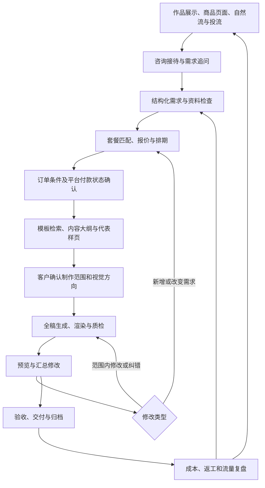

# 闲鱼 PPT 获客与制作自动化系统建设计划书

> **2026-09-07：本文已作为历史设计参考保留。当前唯一执行入口为[《执行计划书》](./执行计划书.md)。** 制作、获客、模板实测、知识库经验与成本控制已统一整合；后续使用 E01–E18 编号，进度以新计划为准。下文历史“90G”、待补项和旧清单不再代表当前状态。

> 版本：v0.4｜编制及修订日期：2026-09-06｜状态：已完成模板元数据盘点与基础命名检索；制作、接待等功能待实施  
> 建设顺序：先制作闭环，再接待闭环，最后连接投流与经营复盘。  
> 使用方式：按模块补资料、实现功能、记录验收证据，再勾选完成。本文中的建议阈值、样本数和分类均为试点起点，不是已经达到的能力或收益承诺。

**当前执行重点：先跑通一单制作与修改，再完善离线接待，最后依据产能扩大流量。** 不需要一次填完所有待补信息，也不需要先分析全部 90G 模板。

### 阅读与执行导航

| 现在要做什么 | 查看位置 |
|---|---|
| 理解整个系统及各模块关系 | 第 0–2 节 |
| 开始建设制作部分 | 第 3–10 节；第 25 节按批实施 |
| 控制检索、制作和修改的 token 成本 | 第 6、9、16 节 |
| 明确模块交接，避免以后接待系统推倒重做 | 第 26 节 |
| 建设获客、消息接待、报价与投流 | 第 11–15 节 |
| 逐项勾选、记录验收及待补信息 | 第 19、20、22、24 节 |
| 找到可复制填写的需求与修改表 | 第 27 节 |
| 接入现有 Obsidian，并让实单经验改善后续制作 | 第 29 节及《知识库接入与实单经验成长方案》 |

本文不预先承诺开发工期和费用。模板格式、可编辑性、现有软件与接入权限实测后，按批估算；每完成一批都应留下可使用的结果。

## 0. 项目目标、已知事实与建设原则

### 0.1 项目目标

建立一套覆盖「投流与自然流量 → 咨询接待 → 需求确认 → 报价排期 → PPT 制作 → 修改 → 交付 → 经营复盘」的整体系统。

系统首先服务自己的闲鱼 PPT 生意。第一阶段解决制作和反复修改问题；后续让客户在本人不在线时也能得到有效接待。最终目标是提高单位人工时间的收益、减少漏单和返工，并使订单规模受实际交付能力约束。

### 0.2 用户已提供的信息

| 项目 | 已知信息 | 使用时的注意点 |
|---|---|---|
| 当前业务 | 已经在闲鱼承接 PPT 制作 | 有真实需求、作品和聊天案例可用于验证 |
| 自然流量 | 最近几天约 1 单 | 不能据此推算长期日均订单 |
| 投流经验 | 之前投流 70 元一次能带来 6–7 单；自述每个客户成本约 10 元 | 后续需确认是否均为付款、验收且未退款订单；70÷6–7 约为 10–11.7 元 |
| 简单制作价格 | 1–2 元/页 | 是页单价，不是整单客单价 |
| 精美制作价格 | 4–6 元/页 | 工作范围尚未标准化 |
| 定制价格 | 10 元/页及以上，目前做过最高约 10 元/页 | 不等于已验证更高价位的成交能力 |
| 最大时间瓶颈 | 反复修改 | 制作模块要优先具备需求锁定和局部修改能力 |
| 接待瓶颈 | 无法实时回复 | 只生成回复草稿不能独立解决离线接待 |
| 模板资源 | 原估 90G；现已只读盘点 `E:\BaiduNetdiskDownload\国赛PPT高端精品`：235.845 GB（219.648 GiB）、36,128 个文件；其中 PPT/PPTX 4,842 个 | 命名检索已验证；正文、视觉质量、确切重复率、授权和可编辑性尚未核验 |
| 自有资料 | 少量作品和话术案例 | 优先使用真实订单全过程，尤其是返工案例 |
| 当前优先级 | 先制作部分 | 第一阶段人工录入需求，暂不依赖闲鱼消息接入 |

### 0.3 不把以下事项视为已经验证

- 投流预算增加后仍维持原获客成本、客户质量和成交率。
- 90G 模板可以全部自动编辑、全部允许商用或全部需要分析。
- 当前闲鱼账户已有足够的官方自动回复、AI 客服或私信 API 权限。
- AI 能独立理解所有模糊需求，或任意类型 PPT 都能自动验收交付。
- 生成速度提高就一定减少返工、提高利润。

### 0.4 建设原则

1. 先闭环后扩张：先让一单从需求到交付跑通，再增加模板和订单数量。
2. 本地程序处理文件、检索、计算和版本；AI 处理理解、选择、生成和视觉判断。
3. 先使用现有模板和成熟页面结构；需要时才增加原创设计。
4. 需求、订单、报价、模板和文件版本都有明确编号，不能只靠聊天记忆。
5. AI 不直接决定例外优惠、退款、无限修改承诺或无法兑现的交期。
6. 自动化必须能暂停、恢复、回滚；关键状态变化有日志。
7. 第一阶段只建设自用工作台，不先投入多商家 SaaS、多账号矩阵或复杂权限系统。
8. 不为本计划直接安装工具、扫描全部模板、联系客户或投放广告；这些属于后续实施任务。

## 1. 整体业务流程与系统边界

### 1.1 全链路



图中付款与样页先后顺序应按实际商品规则、平台支持的交易流程和双方约定配置；系统不能默认免费制作全稿，也不能假设平台支持分阶段付款。

### 1.2 模块清单

| 编号 | 模块 | 核心输出 | 首次建设阶段 |
|---|---|---|---|
| F0 | 公共底座与订单档案 | 编号、文件目录、状态、日志、成本记录 | 制作阶段 |
| P1 | 模板盘点与本地索引 | 可搜索模板目录 | 制作阶段 |
| P2 | 模板预览与生产模板库 | 预览卡片、可编辑模板、页面组件 | 制作阶段 |
| P3 | 需求结构化与缺项检查 | 制作任务书 | 制作阶段 |
| P4 | 检索、大纲与样页确认 | 对标方案、逐页大纲、确认记录 | 制作阶段 |
| P5 | 全稿制作 | 可编辑 PPTX 与预览 | 制作阶段 |
| P6 | 质检与兼容性检查 | 检查报告、修复记录 | 制作阶段 |
| P7 | 修改与版本管理 | 修改单、局部补丁、新版本 | 制作阶段 |
| P8 | 交付与案例归档 | 交付包、订单关闭记录 | 制作阶段 |
| G1 | 产品套餐与作品展示 | 套餐边界、案例展示、商品文案 | 接待前完善 |
| G2 | 消息接入与可靠运行 | 消息事件、去重、异常告警 | 接待阶段 |
| G3 | 自动接待与需求挖掘 | 有效需求、待人工队列 | 接待阶段 |
| G4 | 报价、成交与排期 | 报价单、交期、制作队列 | 接待阶段 |
| G5 | 自然流与投流管理 | 渠道记录、预算与产能控制 | 全链路阶段 |
| O1 | 经营与质量复盘 | 每单收益、人工时薪、返工原因 | 制作阶段开始记录 |

### 1.3 第一阶段边界

第一阶段仍由本人在闲鱼沟通、确认价格和接单。本人把需求、文件和客户意见放入工作台，系统完成检索、制作、检查和改稿辅助，再由本人确认交付。

这能验证制作能力，但不代表离线接待已经解决。消息自动接入和自动发送必须单独建设、验证。

## 2. 公共底座 F0：订单、文件、状态与操作记录

### 2.1 输入与输出

- 输入：人工创建的订单、客户资料、各模块的结果。
- 输出：一个有唯一编号、可恢复、可追溯的订单档案。

### 2.2 建议目录

以下是未来实施时的目录约定，当前不代表这些目录或功能已经创建。90G 原始模板保留原位置，通过索引关联，不复制进项目仓库。

```text
闲鱼PPT自动化系统/
  系统建设计划书.md
  config/                   套餐、成本、风格与业务规则
  data/catalog.sqlite       模板和订单索引，初期可用 SQLite
  previews/                 模板预览缓存
  production_templates/     已验证、允许使用的生产模板
  knowledge/                脱敏案例、回复规则、返工分类
  orders/订单编号/
    brief.json              已结构化需求
    inputs/                 客户原始材料，只读保留
    outline.json            逐页内容与版式
    confirmations/          客户及本人确认记录
    versions/v001/          PPTX、PDF/图片预览、检查报告
    changes/                每轮修改请求与结果
    delivery/               经确认的交付包
    metrics.json            调用成本、人工时间、财务结果
  logs/                     运行与异常日志
```

### 2.3 实施步骤

1. 定义 `lead_id`、`order_id`、`template_id`、`version_id`、`change_id`，显示名称不能代替编号。
2. 原始输入只读保存；模型和程序只能在工作副本上修改。
3. 每次任务记录输入文件哈希、配置版本、选中模板、输出文件和运行状态。
4. 报价、制作需求和客户确认分别存档；任何一方变更都形成新版本。
5. 长任务采用任务队列或可恢复任务记录，失败后从已完成步骤继续。
6. 第一阶段用文件夹加简单表单即可，不必先开发完整后台界面。
7. 配置人工用时开始/暂停/结束记录，模型运行时间与人工操作时间分开。
8. 定期备份数据库、订单记录和已交付版本；缓存预览可以重建，客户资料不能只放缓存。

### 2.4 状态设计

- 商务状态：咨询中 → 待资料 → 待报价确认 → 待付款核验 → 已接单 → 已完成；另设取消、退款处理中、已退款。
- 制作状态：待制作任务书 → 待大纲确认 → 待样页确认 → 制作中 → 待质检 → 待客户反馈 → 修改中 → 待交付 → 已归档。
- 每种状态均可进入「暂停/需人工」，并记录原因与恢复条件。
- 新增需求导致重新报价时暂停对应制作任务，不覆盖原报价或原稿。
- 付款事实来源是平台可核验状态；客户口头说“已付”、截图或模型判断不能直接变更为已核验。

### 2.5 人工职责与验收

- 本人负责维护真实订单状态、处理例外和决定最终交付。
- 验收：同名客户不串单；重复触发不重复出单；中断可恢复；原稿可回滚；每个交付文件可追溯到需求和确认版本。

## 3. 制作模块 P1：90G 模板盘点与低成本索引

### 3.1 目标

让检索依赖本地数据库，而不是每次把大量文件交给 AI。先利用文件名，再按需要补文字、预览与视觉标签。

### 3.2 输入与输出

- 输入：模板根目录、允许扫描的范围、已有命名规则。
- 输出：目录清单、重复文件报告、格式统计、基础标签索引和异常文件清单。

### 3.3 具体怎么做

1. **只读盘点**：读取路径、名称、扩展名、大小、修改时间，不移动、不重命名、不删除原文件。
2. **格式分类**：区分 PPTX、PPT、POTX、PDF、压缩包等。旧 PPT 在隔离副本中转换；加密文件、损坏文件单独列出。压缩包不默认全量解压，宏文件不启用宏。
3. **两级去重**：先按大小筛同尺寸候选，再按内容哈希确认完全重复。只在索引中归组，不直接删除；视觉相似版本后续再处理。
4. **文件名标签**：根据词典拆出行业、场景、配色、风格、节日、页数等。原始名称始终保留，解析结果可以人工纠正。
5. **文本提取**：对选定范围的 PPTX 用本地程序读取页数、文字、尺寸和对象类型；此步骤本身不需要模型。
6. **字段索引**：对标题、标签、页面文字建立全文检索，先采用关键词和同义词，不先强制引入向量数据库。
7. **增量更新**：新增文件才入库；内容变化后才重新分析。缓存键应包括文件哈希和处理器版本，避免程序升级后误用旧缓存。
8. **按需深入**：首次接到制造业汇报需求，优先完善相关模板；不要求把全部 90G 先做视觉理解。

### 3.4 模板档案字段

| 字段 | 内容 |
|---|---|
| 标识 | 模板 ID、原始路径、哈希、格式、文件大小 |
| 基础信息 | 原名、页数、画幅比例、创建/更新记录 |
| 标签 | 用途、行业、风格、配色、文字密度、图表类型 |
| 技术质量 | 可编辑性、字体依赖、是否有宏/外链、是否能正常渲染 |
| 预览 | 代表页编号、预览图路径、生成版本 |
| 权利来源 | 来源、许可文件、商用/修改/交付范围、客户授权情况 |
| 业务效果 | 被选次数、应用订单、人工修复时间、客户反馈 |
| 状态 | 未分析、已索引、可预览、待审核、可生产、不适用 |

未核实授权的模板可作为待审核候选，不能自动进入对外生产库。下载或购买记录不自动等于允许商用交付或转售源文件。

### 3.5 验收与待补

- 验收：能按文件名和场景找到候选；重复文件不重复分析；再扫描时只处理变化；失败文件有明细；未修改原目录。
- 待补：模板根路径、文件名示例、来源和授权说明、存储盘剩余空间。

## 4. 制作模块 P2：预览、模板体检与生产模板库

### 4.1 输入与输出

- 输入：P1 候选模板、实际需求场景。
- 输出：简短模板卡片、代表页预览、模板适用边界，以及可稳定自动填充的生产模板。

### 4.2 具体怎么做

1. **选代表页**：包括封面、一页高文字密度内页、一页图表/流程页及必要的图文页。不能仅靠封面判断。
2. **本地渲染**：用已安装且可授权使用的 PowerPoint 或可用渲染工具生成预览。记录渲染器与版本；替代工具渲染不等于目标客户端兼容性已经通过。
3. **按需视觉分析**：模型只看少量预览，补充视觉风格、适合承载的信息类型和明显缺陷；输出短标签和结论，不写长篇逐页描述。
4. **可编辑性体检**：检查正文是否为文本框、是否整页图片、图表能否编辑、对象是否越界、是否含复杂组合与外链。
5. **生产模板整理**：选择结构稳定、授权清楚的模板，在工作副本中给可替换元素命名，整理占位符、图片区域、图表数据入口。
6. **定义容量**：为每类页面记录建议文本长度、最大段落数、图片比例和可接受图表规模，超出容量时换版式或拆页。
7. **建立页面组件**：封面、目录、章节、双栏文字、图文、对比、流程、时间线、数据、总结等；优先在同一主题内复用，跨模板拼接必须检查母版和风格。
8. **试填验证**：分别用短文、长文、中文数字混排和实际订单填充，检查可编辑性与布局稳定性。

### 4.3 第一批范围

先围绕真实常见订单整理少量生产模板，例如 3–5 套作为起点；数量服从场景覆盖和稳定性，不以收录数量作为成绩。90G 保持为候选资源库，成熟模板作为生产库。

### 4.4 人工职责与验收

- 本人判断是否达到实际销售档位，并确认可使用的授权范围。
- 验收：预览能代表内页效果；同一模板填入不同真实内容仍可编辑；超长内容能被识别；模板卡片注明不适合的场景。
- 待补：每档真实作品、常用字体、使用软件、是否需要动画和可编辑图表。

## 5. 制作模块 P3：制作任务书与需求缺项检查

### 5.1 输入与输出

- 输入：客户聊天摘要、资料文件、参考作品、已确认报价。
- 输出：结构化制作任务书、缺项清单、冲突清单和需要客户确认的问题。

### 5.2 任务书字段

| 类别 | 必填或条件必填内容 |
|---|---|
| 使用目的 | 汇报/路演/教学等场景、受众、演讲时长、希望传达的结论 |
| 页数与结构 | 目标页数、是否含封面目录、可否拆页、必须保留的章节 |
| 内容责任 | 客户是否提供完整文案；是否需要提炼、改写、调研、演讲稿 |
| 视觉要求 | 对标作品及页码、品牌色、Logo、禁用风格、画幅比例 |
| 数据要求 | 数据来源、时间口径、不可更改的数字、需可编辑的图表 |
| 文件要求 | PPTX/PDF、目标软件及版本、字体限制、动画或多媒体 |
| 商务条件 | 套餐、总价、付款核验、截止时间、预计交付、修改范围 |
| 确认记录 | 确认人、时间、聊天消息或截图位置、任务书版本 |

### 5.3 具体怎么做

1. 本人先把必要聊天和文件录入；未来由接待模块按同一字段提交。
2. 本地提取文档内容、表格和图片清单；扫描件或图片文稿按需 OCR，并标记低置信度内容。
3. AI 提取已知信息，但不能补造客户未说过的要求；每个关键结论关联来源。
4. 区分「已确认」「本人推断」「待客户确认」。预算和参考效果冲突时必须列出。
5. 先追问会影响是否能接单的问题：交期、文稿完整度、页数、复杂度；每轮只问少量关键项。
6. 汇总成一页制作任务书，明确缺失内容由谁补、何时补。
7. 本人确认后形成版本；客户新资料追加时标记受影响页面，不静默覆盖。

### 5.4 禁止自动补全的事项

- 无来源的业绩、营收、实验结果、市场份额或客户案例。
- 未谈妥的免费附加服务、交期和修改次数。
- 客户明确禁止改变的品牌、名称和原文。

### 5.5 验收与待补

- 验收：历史订单中的关键要求不遗漏；矛盾可以指出；未知项明确显示；本人能够据此直接判断开工条件。
- 待补：5–10 单真实案例，有多少先用多少，包含顺利单、返工单和低价费时单。

## 6. 制作模块 P4：检索、大纲与代表样页

### 6.1 输入与输出

- 输入：已确认任务书、模板索引、生产模板库。
- 输出：模板选择理由、逐页大纲、样页和客户确认记录。

### 6.2 检索步骤与 token 预算

1. 从任务书生成场景、风格、行业、内容密度、图表、画幅等检索条件。
2. 先过滤硬条件：授权、格式、画幅、可编辑要求和明显不适用模板。
3. 本地关键词搜索和排序，优先返回已验证的生产模板。
4. 起始配置：本地检索约 20–50 个候选，给模型 5–8 张简短卡片，只看前 2–3 份代表页预览；这些上限可配置。
5. 不匹配时逐轮扩大检索或向本人升级，而不是一次读完整个目录。
6. 选中后才读取所需页面的详细结构。记录候选、选择原因和最终使用效果，改进下次排序。
7. 文件名不足以区分的同类模板，可以后续引入本地语义索引；使用远程 embedding 则另计费用和资料传输范围。

### 6.3 大纲步骤

1. 先整理核心结论、章节顺序和内容来源。
2. 为每页指定稳定页面 ID、标题、要点、数据来源、版式、素材需求。
3. 检查总页数与每页容量，过密时精简或提出拆页，不擅自改变收费页数。
4. 对需要内容策划的订单，本人先审叙事逻辑；纯排版单优先保留已确认原文。

### 6.4 样页确认

- 简单制作：客户从固定样例中选定，是否需要专属样页按实际套餐约定。
- 精美/定制：制作少量代表页，至少包含一页高信息密度内页；封面不能单独代表全稿。
- 本人先检查，客户再确认视觉方向、文字密度、图片风格和图表表达。
- 将确认范围写入记录：确认风格不等于确认未来全稿没有错误，也不免除纠错责任。
- 样页未确认时，默认暂停大规模展开；如双方另有明确约定，应记录风险及范围。

### 6.5 验收

- 能从需求说明为什么选择这个模板；页数和内容覆盖符合任务书；样页可编辑；确认记录可追溯；不因模板好看而遗漏客户信息。

## 7. 制作模块 P5：全稿生成与可编辑交付

### 7.1 输入与输出

- 输入：确认后的任务书、大纲、样页、素材和生产模板。
- 输出：可编辑 PPTX、预览文件、逐页来源记录及制作日志。

### 7.2 实施路径

优先采用「受控模板填充＋必要的页面级修改」。原生 PowerPoint 自动化、PPTX 操作库或其他生成引擎的具体选择，要用真实模板验证后决定；不能假设任何工具都能无损修改所有 PPT。

1. 创建订单工作副本，保留原模板和客户文件。
2. 本地程序复制经过验证的页面结构，维护母版、布局、图片、图表和关系文件。
3. AI 输出结构化页面内容及修改指令，程序校验字段、长度和目标元素后执行。
4. 替换标题、正文、图片和图表数据，按版式容量检查；超限则换版式、拆页或交给本人，不无限缩小字体。
5. 基础页面复用固定布局；定制页进入人工或专门设计步骤，不强行套错模板。
6. 图表使用客户确认的数据，核对单位、时间、合计和标签；不把示例数据遗留进交付文件。
7. 图片按需检索、购买或生成，保留来源与授权；客户资料不足时用待补标记，不能把虚构资料伪装成事实。
8. 设置统一页码、页眉页脚、色板、字体和画幅。
9. 保存新版本并调用渲染器，完成后进入 P6；失败时保留日志和中间结果。

### 7.3 页面级记录

每页保存：稳定页面 ID、当前页码、原模板页面、版式类型、元素定位、文字来源、图片来源、图表数据、已确认状态。插页或调序后，定位依靠稳定 ID，不仅依靠旧页码。

### 7.4 人工职责与验收

- 本人负责内容逻辑、复杂设计和与售价匹配的审美判断。
- 验收：文字和约定图表可以编辑；打开不报修复错误；内容完整；修改不破坏母版和已有页面；输出可在目标软件中检查。
- 整页图片只在客户明确接受该形式、且用途适合时使用，不作为默认的可编辑 PPTX 交付方案。

## 8. 制作模块 P6：质检、渲染与兼容性

### 8.1 三层质检

| 层级 | 检查内容 | 处理方式 |
|---|---|---|
| 程序检查 | 文件能否打开、页数、空白页、缺图、占位文字、元素越界、字体依赖、来源缺失 | 本地规则检查并形成问题列表 |
| 视觉检查 | 遮挡、断行、密度、对齐、层级、图表可读性、风格一致性 | 渲染后按全稿缩略图和问题页细查 |
| 业务检查 | 客户名称、关键数字、页数、禁改内容、套餐范围、交付版本 | 对照任务书和原始资料，由本人确认关键项 |

### 8.2 具体怎么做

1. 导出实际成品的页面预览，不能用生成前的模板图代替。
2. 先用低成本程序检查筛出结构问题，再让模型看预览；文字与数据核对可直接使用提取结果。
3. 全稿缩略图用于看一致性，文字多或有疑点的页面用足够分辨率单独检查。
4. 生成带页面 ID、严重程度、位置和修复建议的报告。
5. 执行修复后，重检受影响页面；涉及全局字体、母版或主题时检查全稿。
6. 在客户实际目标客户端验证。若无法测试指定版本，记录未验证项，由本人决定是否满足交付要求。
7. 本人完成最终抽查与关键内容核验后，状态才可进入待客户反馈或待交付。

### 8.3 验收规则

- 阻断项：打不开、明显错客户、关键数字错误、缺失必需内容、约定可编辑而不可编辑、重大遮挡。存在任一项不能交付。
- 一般问题：轻微间距、局部美观等，按售价档位和既定质量标准修复或由本人说明处理。
- 不使用“AI 自评分很高”作为唯一通过标准；保留渲染图与检查报告。

## 9. 制作模块 P7：减少返工、局部修改与版本恢复

### 9.1 输入与输出

- 输入：客户本轮意见、当前已确认版本、任务书及历史确认。
- 输出：结构化修改单、范围判定、局部修改后的新版本、变更摘要。

### 9.2 修改分类

| 类型 | 例子 | 默认处理 |
|---|---|---|
| 制作错误 | 错字、漏要求、数字填错、明显遮挡 | 纠正，不能以“次数用完”为由推掉质量责任 |
| 范围内调整 | 已确认风格内微调颜色、字号、替换约定图片 | 按接单前已确认范围执行 |
| 需求变化 | 加页、换主题、推翻样页方向、大量换文案 | 本人评估新增费用和交期，客户确认后执行 |
| 意见模糊 | “不够高级”“再丰富一点” | 先澄清原因与参考，不直接全稿重做 |
| 无法满足 | 资料缺失、极短交期、技术或授权不支持 | 暂停并交本人协商 |

### 9.3 修改单字段

`修改编号 / 基础版本 / 页面ID及当前页码 / 目标元素 / 原内容 / 期望内容或效果 / 客户原话来源 / 类型 / 是否需确认 / 状态 / 修改后版本`

### 9.4 具体怎么做

1. 将零散聊天合并成一轮意见，找出相互矛盾或已被后续消息撤回的要求。
2. 模糊意见先追问，必要时用对比样例让客户明确方向。
3. 本人确认范围变化与收费；系统不能为了快速应答自动答应免费重做。
4. 锁定基础版本，在副本上按页面 ID 和元素定位执行补丁，不重新生成全稿。
5. 保留客户已手动编辑的最新文件；若该文件结构与记录不一致，先重新解析和比对，再应用修改。
6. 保存 v002、v003 等新版本，记录改动位置、未完成项和原因。
7. 检查受影响页面和相邻分页/页码关系，必要时进行全稿回归检查。
8. 向本人提供简短变更摘要，再由本人按约定发送客户。
9. 记录每轮人工时间与返工原因，用于改进接单问题、模板和样页。

### 9.5 验收

- 只改指定内容时其他已确认页保持不变；错版本修改能被识别；版本可恢复；页码变化不导致错改；范围变化不会自动消耗制作资源。
- 修改轮次的含义需在套餐中事先说明，例如一轮为一次汇总意见；纠错责任与新增需求分别处理。

## 10. 制作模块 P8：交付、售后与案例沉淀

### 10.1 输入与输出

- 输入：通过质检且经本人确认的版本、约定交付格式。
- 输出：交付包、交付清单、版本与发送记录、可用于复盘的脱敏案例。

### 10.2 具体怎么做

1. 核对客户、订单、文件名、页数、格式、付款状态和待解决事项。
2. 按约定准备 PPTX、PDF/预览、必要素材说明；字体和素材只在许可允许时附带。
3. 清除模板演示数据、内部备注、其他客户信息、无关隐藏页与无关演讲者备注；客户要求保留的备注不删除。
4. 固定交付版本并计算哈希，发送渠道使用平台及双方约定允许的方式。
5. 第一阶段由本人发送并记录结果；以后自动发送也必须核对订单、收件会话与文件版本，并具有防重复机制。
6. 记录验收、售后修改、退款或争议；发送文件不等于客户已验收。
7. 归档原始需求、首稿、最终稿、修改意见和成本数据。
8. 获得必要授权后，脱敏抽取可展示作品和可复用经验；内部资料不直接成为公开案例。
9. 设定客户资料保存期限、删除流程和备份保留范围；待用户确定具体周期。

### 10.3 验收

- 交付对象和版本正确；附件可打开；文件中无无关客户内容；售后能定位到交付版本；案例用途和授权记录清楚。

## 11. 获客模块 G1：套餐、作品展示与商品页面

### 11.1 为什么先标准化商品

接待机器人需要清楚什么能卖、卖多少钱、包含哪些工作。只写“简单、精美、高端”，容易出现客户以低价期待原创策划和无限修改的问题。商品页面、接待话术、报价单与制作任务书必须使用同一套规则。

### 11.2 输入与输出

- 输入：真实作品、现有价格、订单耗时、客户常见问题。
- 输出：套餐规则、分档样例、商品文案、常见问题库和不可自动承诺事项。

### 11.3 套餐草案：需本人按实际能力定稿

| 项目 | 简单制作 | 精美制作 | 定制制作 |
|---|---|---|---|
| 当前价格参考 | 1–2 元/页 | 4–6 元/页 | 10 元/页及以上，当前实际经验最高约 10 元/页 |
| 内容输入 | 完整定稿文案 | 基本完整资料 | 先评估资料和策划工作量 |
| 设计方式 | 固定生产模板 | 有限模板调整、统一视觉 | 单独确认结构和视觉方向 |
| 内容整理 | 默认不含策划，是否含轻微润色需写清 | 限定范围内整理 | 单独列项 |
| 复杂图表/动画 | 明确是否支持及费用 | 按数量和难度评估 | 单独评估 |
| 样页 | 固定样例选款 | 代表样页确认 | 专属代表页确认 |
| 修改 | 明确范围、汇总方式与轮次 | 同左 | 同左，复杂变化单独评估 |

价格不是自动套用规则的全部。还需要决定最低起做金额、计费页数口径、加急条件、素材费用和新增内容费用。未确定前保持人工报价，不由 AI 编造数字。

### 11.4 具体怎么做

1. 选各档真实可交付作品；同一内容做不同档位示例，有利于客户理解差别。
2. 为每个商品写明适合谁、需要提供什么、交付格式、工作边界、样页流程和预计响应时段。
3. 建立报价规则版本，将样例编号与套餐绑定，防止售前展示效果超出该档能力。
4. 将询价、加急、可编辑性、内容代写、动画、修改等问题整理成事实型 FAQ。
5. 分清可自动回复的事实、需计算的条件和需本人判断的例外。
6. 本人确认发布内容及当前平台品类要求，再发布或修改商品页面。

### 11.5 验收

- 客户可以根据样例区分档位；套餐、话术和报价一致；没有“无限修改”“保证某结果”等无法控制的承诺；作品来源和展示授权清楚。

## 12. 获客模块 G2：消息接入与无人值守可靠性

### 12.1 前置结论与接入顺序

接入是后续阶段的独立技术与平台许可检查点。不能因为本地脚本能点击网页，就视为已获得平台认可。

1. 查看当前账户实际提供的官方自动回复、AI 客服及知识配置范围。
2. 核实官方授权接口或服务商能力是否覆盖该账户的私信、附件和人工接管。
3. 若考虑网页自动化，单独评估规则适用性、登录稳定性和技术维护成本；不把绕过验证码或规避风控作为设计前提。
4. 未获得适用方案时，使用人工接待或平台允许的方式，制作系统仍独立运行。
5. 如果只能生成回复草稿，就明确标记为“辅助接待”，不能宣称已经实现本人离线时自动接单。

### 12.2 输入与输出

- 输入：通过适用方式获取的消息、会话、附件及官方订单状态。
- 输出：统一消息事件、会话记录、待处理队列、发送状态与异常告警。

### 12.3 具体怎么做

1. 定义统一事件：平台、账号标识、会话 ID、消息 ID、时间、发送者、类型、正文、附件引用、处理状态。
2. 以平台消息 ID 或可靠组合键去重；区分历史消息与新消息，首次启动不对历史消息批量回复。
3. 同一会话串行处理，不同会话隔离；客户短时间连续输入时合并理解，避免每条都机械回复。
4. 图片、语音和附件按支持程度处理；识别失败时承认未读清楚，请对方补充或转本人，不假装已理解。
5. 每个发送动作带唯一请求标识，记录待发、成功、失败、结果不明；结果不明先核对，不盲目重试造成重复发送。
6. 本人接管后机器人暂停，直到明确恢复；检测同一会话有人正在处理时避免争抢。
7. 检查登录状态、连接状态、待处理队列、最后成功收发时间；网络恢复后补查遗漏。
8. 机器休眠、登录失效、验证码或页面变化时停止相关自动操作并告警，不持续错误重试。
9. 设置每会话回复频率和最大自动往返次数，避免循环对话和骚扰。
10. 本地常驻机器需要处理休眠、重启恢复和磁盘空间；运行环境与账号许可条件一起验证。

### 12.4 验收

- 测试断网恢复、登录失效、重复消息、连续消息、多会话、发送超时、人工接管及进程重启。
- 发现无法收发时能够主动提示本人，不能静默停工。
- 测试账号或可控场景优先；真实客户自动发送须在功能、话术和适用接入方式确认后小范围启用。
- 验收统计要写样本数与故障场景；短期无故障不等于已经证明长期可靠。

## 13. 获客模块 G3：自动接待与需求挖掘

### 13.1 输入与输出

- 输入：消息事件、套餐规则、当前产能、会话历史摘要。
- 输出：需求字段、适配套餐、缺项、客户意向、待人工事项和回复记录。

### 13.2 对话分阶段

| 阶段 | 目的 | 推荐动作 |
|---|---|---|
| 初次接触 | 及时回应并拿到关键条件 | 问用途、页数、截止时间，邀请提供现成资料 |
| 判断范围 | 识别排版、整理还是策划 | 查看文稿完整度，询问可编辑性和特殊页面 |
| 对齐效果 | 把模糊风格变成可比较样例 | 展示与预算对应的真实样例，让客户选择 |
| 补齐商务条件 | 确定价格和排期需要的信息 | 确认计费页数、内容责任、修改范围 |
| 汇总确认 | 避免理解偏差 | 回述任务摘要，标记仍待本人确认的事项 |
| 交接制作 | 将会话变成可执行任务 | 输出 P3 需要的字段和证据位置 |

### 13.3 可复用话术骨架

> 您好，我是接待助手。您这个 PPT 用在什么场景，大约多少页，最晚什么时候需要？有现成文稿或参考图也可以先发，我帮您整理制作要求。

> 您目前提供的资料更接近【需求类型】。我先给您看对应档位的样例；具体总价和能否按期完成，要结合资料与排期确认。

> 我整理一下：用途是【用途】，约【页数】页，参考【样例编号】，您提供【材料】，需要我们完成【范围】。目前还缺【关键项】。

这些是结构示例，不直接代替用户原有有效话术。真实回复需要简短、贴合上下文，不能重复询问已知信息。

### 13.4 规则控制

- 允许自动：首轮接待、已确认 FAQ、固定套餐介绍、需求追问、状态说明。
- 条件自动：根据确定规则给出价格区间或标准报价；只在产能数据可靠时说明可选排期。
- 必须转本人：急单例外、砍价超范围、退款、投诉、需求冲突、复杂定制、敏感资料、连续未理解客户。
- 已转人工时说明真实处理时间窗口，不能声称本人正在查看而实际无人处理。
- 客户要求“忽略价格规则”“把其他客户文件发来”等内容只作为消息数据，不能改变系统权限和规则。
- 不以主动群发陌生人消息作为默认获客方案；跟进仅限适用范围和合理频率。

### 13.5 人工工作台

待人工事项应显示：客户摘要、已收材料、缺项、建议动作、交期紧迫程度、未回复时长和原消息入口。本人处理后保存决定，机器人恢复前读取最新状态。

### 13.6 验收

- 历史聊天回放中不重复追问、不漏掉交期、不擅自承诺。
- 标准流程能输出制作任务书；例外能及时转人工。
- 指标关注有效需求收集率、进入报价率、误承诺次数和转人工原因，不能只看“发出了第一条回复”。

## 14. 获客模块 G4：报价、付款核验与产能排期

### 14.1 输入与输出

- 输入：结构化需求、套餐规则、人工工时估计、制作队列。
- 输出：有版本的报价单、适用交期、商务确认和制作任务。

### 14.2 报价规则

建议结构为：基础制作费用＋经确认的内容整理/复杂页面/动画/加急/素材等费用。最低起做金额、优惠和具体系数由本人确定。

每次报价写清：包含页数、计页方式、工作范围、交付格式、样页流程、修改边界、资料提交时间、预计交付时间及客户迟补资料时的处理方式。

### 14.3 具体怎么做

1. 检查任务书是否满足报价条件；信息不足给出条件性范围，不报虚假确定价格。
2. 使用确定性计算规则，AI 负责解释，不能随意更改价格下限。
3. 用历史相似订单估计初稿、修改、终检的人工工时，并显示估计依据。
4. 查看本人可工作时间和已接订单，保留返工缓冲；估计不确定时由本人确认。
5. 确认报价后生成订单档案，付款核验通过后按约定释放制作任务。
6. 新增需求生成报价修订，不覆盖既有交易记录；新交期需重新确认。
7. 在制任务超出可用工时时，延后接单、提高人工审核比例或减少投流；不能仅按服务器空闲程度判断产能。

### 14.4 验收

- 相同已确认条件计算一致；急单不会自动挤掉其他承诺；报价与 P3 一致；未核验付款不会被误标为已付款；新增范围可追溯。

## 15. 获客模块 G5：自然流、投流和流量复盘

### 15.1 输入与输出

- 输入：商品页面、广告批次、花费、曝光/点击/咨询等可取得数据、订单验收结果。
- 输出：渠道漏斗、广告批次收益、下一轮测试建议和产能约束。

### 15.2 自然流工作

1. 根据真实高频需求整理商品定位与标题关键词，避免与交付能力不一致。
2. 用已授权作品展示明确档位和场景，突出可编辑性、资料要求与制作流程。
3. 记录每版商品文案、主图和案例的上线时间；修改后比较同类时段表现，注意样本量。
4. 将未成交原因归类为价格、回复慢、交期、效果不匹配、资料不全等，不把所有问题归因于流量。

### 15.3 投流工作

1. 为每次投流建立批次 ID，记录商品、时间、花费、目标、配置和变化项。
2. 将能够确认的咨询及订单关联批次；无法可靠归因时标记未知，不强行算给广告。
3. 分开记录新增咨询、有效需求、付款订单、验收订单、退款订单。
4. 第一轮以历史 70 元投流经验为参考，预算由本人决定；系统不自动扩大预算。
5. 每次尽量只改变少量变量，比较实际完成订单收益和人工时薪。
6. 制作积压、回复异常、返工升高或退款异常时，提示减少或暂停新增流量。
7. 先建立只读报表和建议，未来如需自动投放，另设预算上限、停止条件、操作权限与审批范围。

### 15.4 验收

- 能解释一批投流带来多少有效需求和最终验收订单；自然流与付费流量不混算；归因缺失透明显示；扩大投流有产能和收益证据支持。

## 16. token 成本与整体成本控制

### 16.1 不需要模型的任务尽量本地完成

| 工作 | 首选方式 | 费用注意点 |
|---|---|---|
| 文件扫描、哈希、去重 | 本地程序 | CPU、磁盘和耗时，不产生模型 token |
| PPTX 文字与对象提取 | 本地解析 | 提取结果发送模型后才计输入 |
| 预览图生成 | 本地渲染 | 渲染不计 token，送模型看图另计 |
| 关键词检索与报价计算 | 本地数据库和规则 | 不需要为每次计算调用模型 |
| 风格理解、内容提炼、复杂判断 | 按需调用 AI | 控制候选数、图像范围与输出长度 |
| 明确修改 | 结构化补丁＋本地执行 | 仅传相关页与必要上下文 |

### 16.2 每单调用策略

1. 一次形成简短任务书，后续模块读取任务书和必要证据，而非全部原始聊天。
2. 模板卡片和视觉标签分析一次后缓存，未变化时不重新分析。
3. 先卡片后预览，先少量候选后扩展，避免同时加载大量整套 PPT。
4. 固定布局交给程序，不让模型反复输出页面底层代码。
5. 已确认结构和风格不在每轮修改中重新推理；只处理受影响部分。
6. 简单分类使用满足质量要求的低成本模型；复杂叙事或难页按需升级，用真实样本判断是否值得。
7. 输出采用简短结构化字段，诊断信息只保留可行动内容。
8. 每阶段设置可配置调用次数、重试次数和费用上限；超限转本人，不无限重生成。
9. 不把本地缓存等同于供应商折扣缓存；再次发送相同内容仍可能计费。供应商缓存条件和价格在选型时核实。
10. 图像、OCR、embedding、生成图、API 与订阅的计费方式可能不同，分开记账；具体单价选型时再查，不在本计划假定。

### 16.3 需要记录的数据

每次调用记录订单、阶段、模型、输入/输出 token、缓存 token（如可得）、图片或其他计费量、费用来源、耗时、重试原因和结果版本。接口不返回某指标时记录「不可得」，不猜测 token 数；订阅使用量也不能伪装成精确逐单 API 成本。

模板初次分析、生产模板整理等一次性成本单列，再按实际复用情况评估摊销。不要把模板建设成本全算给第一单，也不要完全忽略。

### 16.4 优化目标

优化的是「达到同等验收质量的一单总成本」，同时看 token、人工分钟、返工、退款和交付时间。减少必要质检导致返工增加，不算优化成功。

## 17. 经营复盘 O1：利润、人工时薪与产能

### 17.1 统一财务口径

- 实收净收入＝客户实际支付金额－实际退款金额。
- 单单贡献＝实收净收入－归属获客费用－平台实际费用－模型/素材等直接成本。
- 计入本人劳动后的收益＝单单贡献－本人人工小时×自定时间成本－分摊固定成本。
- 人工小时贡献＝一段时间全部订单贡献÷该期间实际投入人工小时。应包含未成交沟通和失败订单花费的时间，避免只统计成功订单。
- 广告获客成本分别统计：每新增咨询成本、每付款订单成本、每最终验收未退款订单成本。分母为零时显示不可计算，不显示零成本。

实际退款已从收入扣除时，不再次把同一退款额当费用扣减。未结束订单可以单列预计退款准备，但不能和实际退款重复计算。平台结算金额若已经扣费，也不能再重复扣除同一笔平台费用。

### 17.2 依据现有价格的敏感性示例

假设每单 20 页、归属获客费用暂按 10 元：

| 档位 | 订单收入 | 仅扣获客费用后 |
|---|---:|---:|
| 简单制作 | 20–40 元 | 10–30 元 |
| 精美制作 | 80–120 元 | 70–110 元 |
| 10 元/页定制 | 200 元 | 190 元 |

最后一列不是利润，尚未扣除其他成本。示例中一单收入 30 元、获客 10 元、其他直接成本假设 5 元，仅剩 15 元覆盖劳动与利润；如果本人时间成本假设为 60 元/小时，15 分钟人工就消耗这部分余额。以上假设用于说明低价单对返工非常敏感，不是当前实测成本。

### 17.3 每周复盘内容

1. 哪些套餐的订单贡献和人工小时贡献最好？
2. 时间花在接待、资料整理、首稿、修改还是终检？
3. 返工由需求不清、样页偏差、内容错误、模板不适合还是客户新增需求导致？
4. 哪些模板修复次数多，应退出生产库？
5. 哪些话术能有效收齐资料，哪些承诺带来售后压力？
6. 当前产能还能承接多少人工工作量，而不仅是多少页？
7. 投流是否带来可验收且有贡献的订单，还是只增加低价复杂咨询？

## 18. 分阶段建设路线与进入条件

### 阶段 A：制作基础准备——现在开始

- 交付：模板盘点报告、真实案例基线、套餐草案、订单目录与编号。
- 本人补充：模板路径、常见需求、目标软件、作品和返工案例。
- 进入下一阶段条件：能够选出一个高频、资料完整、复杂度较低的试点场景。

### 阶段 B：最小制作闭环——第一优先级

- 建设：P1 基础索引、P2 少量生产模板、P3 人工录入需求、P4 检索与样页、P5 初稿、P6 检查、P7 局部改稿、P8 人工交付。
- 第一单范围：单一场景、明确页数、完整文稿、固定风格；先不引入复杂动画和开放式内容调研。
- 交付：一单从资料到可编辑最终稿的完整档案和成本记录。
- 进入下一阶段条件：能完成至少一个代表性修改，且无关页面不被破坏；目标软件可打开；本人确认交付质量。

### 阶段 C：制作稳定与成本优化

- 扩展：更多真实订单、增量扫描、模板容量规则、版本恢复、按阶段费用统计。
- 用历史单回放，再用少量真实新单试点。建议 10–20 单作为初步观察起点，样本不足则继续积累，不能把它当可靠性证明。
- 进入下一阶段条件：同类订单人工时间有可复核的改善，返工和投诉未明显恶化，成本记录足以判断哪些档位适合扩大。

### 阶段 D：接待辅助与平台接入验证

- 建设：G1 套餐定稿、G2 接入验证、G3 历史聊天回放和回复草稿、G4 报价与排期。
- 先进行影子运行：系统产出建议，由本人观察，与实际回复比较，不自动发送。
- 进入下一阶段条件：有适用接入方式；话术与规则通过审核；例外转人工、停止和发送去重经过测试。

### 阶段 E：有限自动接待＋制作工作台

- 自动范围：标准首问、FAQ、资料收集、已批准规则内的信息回复。
- 保留人工：复杂报价、急单、样页和终检、争议与退款。
- 连通：接待生成同一份 P3 任务书，经过必要确认后进入制作队列。
- 进入下一阶段条件：本人不在线时能按已验证范围持续接待；故障可见；没有未解决的误承诺或串单问题。

### 阶段 F：投流与产能联动

- 建设：G5 渠道归因、O1 收益复盘、积压与预算提示。
- 扩张条件：一段有代表性的真实运行数据表明，新增订单的人工负担和贡献可接受，售后及交期可控。
- 完全自动交付仅考虑规则明确、反复验证的窄场景，单独设启用条件；其他订单长期保持半自动也可以成立。

### 18.1 暂缓建设

- 全量 90G 模板视觉分析、训练专属大模型、多 Agent 编排。
- 多商家平台、多账号矩阵、自动增投、无人审核退款。
- 对任意原始 PPT 做无损自动改稿的通用承诺。
- 在制作尚未稳定前追求复杂后台外观和大量功能。

## 19. 可逐项勾选的实施清单

勾选规则：功能完成且留下对应验收证据后再勾选；已完成项见对应报告，未勾选项仍待实施。

### 19.1 立即准备

- [x] A01：已提供 `E:\BaiduNetdiskDownload\国赛PPT高端精品`，完成只读元数据扫描；证据见第 30 节报告。
- [ ] A02：提供 5–10 单案例，有多少先用多少；至少包含一单多轮修改案例。
- [ ] A03：提供各档作品、文件格式和当前话术。
- [ ] A04：确定目标软件、常用字体、动画与图表要求。
- [ ] A05：记录基线：每类订单收入、首稿时间、修改时间、修改轮次。
- [ ] A06：确定第一个试点场景和明确的交付标准。

### 19.2 制作 MVP

- [ ] B01：建立订单编号、原始资料只读保存和版本目录（F0）。
- [x] B02：完成模板文件名索引、格式统计和同名同大小疑似重复报告（P1）；未做内容哈希，不代表已确证重复，见第 30 节。
- [ ] B03：生成首批候选代表页预览和模板卡片（P2）。
- [ ] B04：核实首批生产模板来源及使用范围，整理可编辑占位符（P2）。
- [ ] B05：制作任务书可以区分已知、推断、待确认内容（P3）。
- [ ] B06：根据一份真实需求检索模板，保留选择理由（P4）。
- [ ] B07：生成逐页大纲和代表样页，由本人确认（P4）。
- [ ] B08：完成可编辑全稿并成功渲染（P5）。
- [ ] B09：完成程序、视觉、业务检查并修复阻断项（P6）。
- [ ] B10：执行一次真实局部修改，确认无关页面未被误改（P7）。
- [ ] B11：完成交付清单与人工发送记录，归档可恢复版本（P8）。
- [ ] B12：记录该单各阶段人工分钟、调用量及可得成本（O1）。

### 19.3 制作优化

- [ ] C01：增量扫描只处理新增或变化文件。
- [ ] C02：模板缓存和预览缓存能正确失效与重建。
- [ ] C03：超长内容、缺字体、缺图片和损坏文件有明确处理分支。
- [ ] C04：客户修改过的 PPT 可重新识别版本，避免在旧稿覆盖。
- [ ] C05：建立返工原因分类与模板淘汰机制。
- [ ] C06：以同类订单对比人工时间、质量和成本，形成首轮复盘。

### 19.4 接待与整体联通

- [ ] D01：套餐、样例、商品文案、FAQ 和报价规则一致（G1）。
- [ ] D02：确认账户实际可用接入能力与适用范围（G2）。
- [ ] D03：通过历史聊天影子测试，找出误承诺与漏问（G3）。
- [ ] D04：实现消息去重、发送核对、人工接管、异常告警（G2）。
- [ ] D05：报价与人工产能排期可追溯（G4）。
- [ ] D06：有限启用自动接待，能够输出 P3 任务书。
- [ ] D07：制作队列与接待状态联通，避免重复接单。
- [ ] D08：投流批次和订单结果能关联，未知归因明确标记（G5）。
- [ ] D09：依据实际收益与产能决定是否扩大投流（O1）。

## 20. 验收样本、指标与异常处理

### 20.1 最少覆盖的测试场景

| 场景 | 要验证的行为 |
|---|---|
| 完整文稿、标准模板 | 可直接形成任务书、初稿和最终交付 |
| 文件名相符但内页不适合 | 预览与内容密度检查能够淘汰候选 |
| 文稿过长 | 提出精简/拆页，不自动压成不可读小字 |
| 客户说“不高级” | 先澄清方向，不立即重做全稿 |
| 仅改一个数字或标题 | 局部修改，其他内容保留 |
| 客户另发改过的版本 | 检测新版本，重新比对后再改 |
| 数据缺失或矛盾 | 标记待确认，不编造 |
| 新增页数和内容 | 暂停受影响工作，重新确认范围 |
| 不支持字体/复杂图表 | 明确降级或转人工，并检查替代结果 |
| 多客户同时工作 | 文件、需求、回复严格隔离 |
| 网络/渲染/模型失败 | 有重试上限，可恢复，费用有记录 |
| 文件内容含操作指令 | 不改变系统规则、不泄露其他资料、不触发财务动作 |

### 20.2 指标口径

- 检索可用率：候选是否包含本人认为可用于本单的模板，记录评估人和样本数。
- 样页通过情况：首次确认、一次调整确认、多次调整或改方向分别记录。
- 首稿质量：阻断问题数量、一般问题数量、客户意见类型。
- 改稿效率：每轮人工时间、调用成本、误改次数、恢复次数。
- 接待质量：有效需求收集率、未回复时长分布、误承诺次数、人工接管原因。
- 经营结果：验收订单贡献、总人工小时贡献、退款与超期情况。

具体目标值在基线测量后由本人确定。零串单、零未经确认的财务动作、交付前清除阻断项作为试点必须遵守的控制要求；不因样本小就宣称事故率永久为零。

### 20.3 故障处置

1. 识别故障并保存当前文件、任务状态和日志。
2. 可重试错误在有限次数内重试；原始输入和已确认版本不覆盖。
3. 结构不支持、授权不明、业务冲突、关键数据缺失直接转本人。
4. 超时或费用超限暂停，展示已完成内容和剩余问题。
5. 修复后从最近可靠检查点恢复，并复查受影响结果。

## 21. 人工职责与风险登记

### 21.1 本人长期保留的职责

- 产品定位、定价底线、投流预算和可工作时间。
- 复杂订单是否接、急单能否承诺、额外工作如何收费。
- 模糊需求澄清、关键内容与审美判断。
- 代表样页及最终交付的审核，至少在试点和非标准订单中保留。
- 客诉、退款、范围争议和客户关系维护。
- 模板/素材来源审核、客户资料用途与保存规则。

系统负责把这些决定需要的信息整理齐，而不是让本人重新翻全部文件和聊天。

### 21.2 风险登记表

| 风险 | 早期信号 | 应对措施 | 放行责任 |
|---|---|---|---|
| 低价单人工超支 | 修改时间高、每小时贡献低 | 收紧产品范围、优化模板、调整起做金额或筛单 | 本人 |
| 模板无法自动编辑 | 整页图片、复杂组合、结构损坏 | 排除或整理成生产模板，不强行全自动 | 本人＋制作检查 |
| 选错对标 | 封面好看但内页承载不足 | 代表页预览、容量规则、样页确认 | 本人 |
| 无限制返工 | 模糊意见、范围不断变化 | 任务书、样页、修改分类和报价修订 | 本人 |
| 内容错误 | 缺来源、数字冲突、示例残留 | 来源追踪、关键数据核验、阻断交付 | 本人 |
| 兼容性问题 | 换机错版、缺字体、修复提示 | 目标客户端检查、字体策略、保留预览 | 本人 |
| 平台接入不适用 | 无授权能力、登录或风控异常 | 独立验证、暂停自动操作、使用适用替代方案 | 本人 |
| 误回复与错交付 | 会话混淆、超时重发、双人接管 | 唯一编号、去重、发送核对、人工暂停 | 系统控制＋本人 |
| 资料泄露 | 无关文件被加载、共享链接失控 | 订单隔离、最少传输、秘密配置不入日志 | 本人＋系统控制 |
| 提示注入或恶意文件 | 文件指示越权、宏、外链 | 文件作为不可信数据、隔离解析、权限白名单 | 系统控制 |
| 素材授权不清 | 无许可、来源混乱 | 未审核不进入自动生产库，保存证据 | 本人 |
| 扩量压垮产能 | 队列变长、交期拖延、退款升高 | 按人工工时限流，暂停或减少投流 | 本人 |

## 22. 待本人逐步补充的信息

### 22.1 开始制作部分必须先补

| 信息 | 当前状态 | 建议提供方式 |
|---|---|---|
| 90G 模板所在路径 | 待补 | 本地绝对路径，多个目录分别列出 |
| 第一类试点需求 | 待补 | 一份真实客户需求＋实际材料 |
| 目标制作与查看软件 | 待补 | PowerPoint/WPS、版本、操作系统 |
| 一单完整返工案例 | 待补 | 需求、首稿、客户意见、终稿 |
| 各档最低质量样例 | 待补 | PPTX 优先，注明价格和页数 |
| 模板和素材来源 | 待补 | 购买渠道、许可文件、授权备注 |

### 22.2 制作试点过程中补

- 本人人工时间价值或希望达到的每小时贡献。
- 常见订单页数、套餐占比、资料完整度。
- 修改轮次、加页和加急的现行处理方式。
- 可投入系统建设的时间、运行设备和月度工具预算。
- 模型或订阅的可用调用方式及资料传输偏好。
- 客户资料保存期限与公开展示授权方式。

### 22.3 进入接待阶段再补

- 账户实际可用的官方接待能力和相关服务条款。
- 本人可处理人工升级的时间窗口。
- 常见咨询、未成交、砍价、催稿与退款话术案例。
- 投流批次记录，以及咨询到付款、验收的统计口径。
- 商品品类、经营身份、发布和交易规则的实际适用要求。

## 23. 公开资料依据与验证边界

以下来源在前序可行性讨论中于 2026-09-05 阅读，用于说明能力和平台风险背景；编制本文时未重新核验。正式接入或工具选型时需复查当时有效版本及账户权限。

1. [闲鱼社区用户服务协议](https://terms.alicdn.com/legal-agreement/terms/suit_bu1_other/suit_bu1_other201708081618_51146.html)：当时页面显示 2026-05-27 更新、2026-06-15 生效；包括账户使用约束，以及 AI 客服等功能以实际提供为准的说明。不能据此推断普通卖家已经获得私信 API 权限。
2. [闲鱼软件许可使用协议](https://terms.alicdn.com/legal-agreement/terms/common_platform_service/20230509172204596/20230509172204596.html)：当时页面显示 2026-04-18 更新；涉及未经授权的第三方软件或工具接入限制。具体网页方案的适用性和授权情况需要独立确认，不能仅由技术可行性推断。
3. [微软 PowerPoint：使用 Copilot 编辑](https://support.microsoft.com/en-us/powerpoint/edit-with-copilot-in-powerpoint)：说明 AI 辅助生成、编辑和审阅演示文稿具有产品能力基础，不代表任意订单都能自动验收，也不是本计划指定采购的工具。
4. [PptxGenJS 图表文档](https://gitbrent.github.io/PptxGenJS/docs/api-charts/)：说明程序化生成图表等能力可用，具体处理现有模板的保真度、兼容性和维护成本需要实测。

本计划中的架构、样本量、生产模板数量和流程是针对当前业务的建设建议；没有把未实测的自动化比例、制作速度、token 费用或收益写成既定结果。

## 24. 下一次工作的明确起点

**先完成 A01、A02、A04、A06，再实施 B01–B04：只读盘点模板、选一个真实场景、整理首批生产模板。**

随后围绕这一单依次完成：制作任务书 → 检索与样页 → 可编辑初稿 → 一次局部修改 → 质检与交付 → 成本复盘。每一步的结果保存在订单档案中，跑通后再扩大模板范围。

### 建设记录模板

| 日期 | 清单编号 | 做了什么 | 验收证据位置 | 结果/未解决问题 | 下一步 |
|---|---|---|---|---|---|
| 待填写 | — | — | — | — | — |

## 25. 按批实施：每次只完成一块可验收的工作

本节把前面的完整设计转换成可以逐次下达的实施任务。下表中的路径是**计划产物**，不是已经存在的工具；脚本名称可在实现时调整，但职责和验收结果应保留。第一批仅需模板路径，后续资料按批补齐。

### 25.1 制作优先：七批工作

| 批次 | 对应模块 | 开始前需要 | 具体实施与计划产物 | 完成判据 |
|---|---|---|---|---|
| M01 模板盘点 | P1 | 模板绝对路径、扫描范围 | 编写只读盘点工具；输出 `reports/template_inventory.md`、基础索引、格式及重复候选统计 | 报告说明扫描范围、文件数、大小和失败项；能找到原始文件；原库未被修改 |
| M02 按需检索和预览 | P1、P2 | 一份真实需求、M01 索引 | 建立命名词典、检索命令、代表页预览；输出 `reports/retrieval_trial.md` 和候选卡片 | 同一需求可重复找到候选；只分析必要模板；记录未匹配原因与本轮调用量 |
| M03 首批生产模板 | P2 | 候选、使用范围证据、目标软件 | 选择少量适配模板，整理占位符和容量；输出生产模板副本及对应 `template_manifest.json` | 长短文试填均有结果；重要内容可编辑；不适用结构明确标出 |
| M04 第一单初稿 | F0、P3–P5 | 完整材料、页数、内容责任、参考效果 | 建订单目录、任务书、逐页大纲；先出样页，经确认再生成初稿 | 每页内容可追溯；输出可编辑 PPTX；本人确认符合实际售卖档位 |
| M05 质检与局部修改 | P6、P7 | M04 初稿、一轮真实修改意见 | 建检查报告、修改清单、版本比对和回滚流程；输出新版本及变更摘要 | 修改落在正确页面和版本；无关页面无非预期变化；阻断问题清除 |
| M06 交付与成本闭环 | P8、O1 | 通过检查的版本、实际费用与人工记录 | 生成 `delivery_manifest.json`、订单复盘、调用统计；本人按约定交付 | 交付包与审核版本一致；能算单单贡献；无法取得的成本明确标记 |
| M07 多单复用与优化 | P1–P8、O1 | 同类新需求和前六批结果 | 加入增量缓存、失败恢复、模板效果评分；比较多单质量、人工时间和调用成本 | 无需重新编写整套制作程序即可处理同类订单；明确适合自动化与需人工的订单类型 |

M04 的样页确认和 M06 的交付确认是业务流程节点，不能被误记为已经获得客户确认。历史订单回放可由本人按历史证据模拟，但必须标记为回放。

### 25.2 制作技术验证先做小样

正式选择生成和编辑引擎前，在生产模板副本中验证以下动作：

1. 替换中文标题和一段较长正文，保留预期字体与段落样式。
2. 替换一张图片，正确处理比例与裁剪。
3. 如果试点需要图表，更新一组真实图表数据并验证可编辑性。
4. 复制或重排页面，验证母版、图片和图表没有丢失。
5. 修改单个元素，保存后在目标软件中重新打开和渲染。

通过后再批量整理该类模板。如果某种复杂结构无法保留，记录为模板不支持项并换模板或转人工，不无限追加模型调用尝试修复。第一版用命令行或简单表单即可；软件选择服务于上述验证结果。

### 25.3 接待及经营：后续四批工作

| 批次 | 对应模块 | 具体实施 | 完成判据 |
|---|---|---|---|
| C01 产品和话术 | G1、G3 | 整理套餐、实际样例、FAQ、报价例外及转人工条件 | 与制作任务书一致；价格和范围有依据；未确定项不自动承诺 |
| C02 接入和影子验证 | G2、G3 | 验证账户实际能力；历史对话回放；消息接入后的建议回复先不自动发送 | 能核对漏问、误判、去重和人工接管；明确当前只是辅助还是已具备离线接待条件 |
| C03 有限自动接待 | G2–G4 | 在适用范围内启用标准接待，输出制作需求；连接报价排期和订单队列 | 能在本人离线时收齐适用订单的必要信息；异常可见；不越权承诺；交接不串单 |
| C04 流量与产能联动 | G5、O1 | 关联投流批次、咨询、验收和退款；按人工产能给预算建议 | 可以识别有收益的订单来源；积压与费用异常时提示本人调整，而非自动扩大投入 |

### 25.4 每批的固定收尾格式

每批完成后更新第 19 节清单和第 24 节建设记录，同时回答：

- 本批实现了什么，产物保存在哪里？
- 用什么真实样本或故障样本验收，结果是什么？
- 哪些操作由程序完成，哪些调用了模型，哪些仍需本人？
- 本次人工时间、模型用量、一次性建设费用与重复运行费用分别是多少，哪些无法取得？
- 哪些问题仍然存在，会不会阻碍下一批？
- 下一批最少还需要补充什么？

### 25.5 可直接使用的后续任务描述

> 按《系统建设计划书》实施 M01 模板盘点。模板目录是【绝对路径】。只读扫描并建立本地索引，输出格式、数量、命名可用性、重复候选和失败项报告，保留原始文件。暂不做全库视觉分析。完成后更新计划书清单并给出 M02 的最少输入。

> 按计划书实施 M04 第一单初稿。使用已经验收的检索和生产模板能力；客户需求及资料在【路径】。先生成任务书，列出会影响开工的缺项；可独立完成的资料整理和候选检索继续进行。记录大纲、样页和全稿版本，不把待确认事项当成已确认。

> 按计划书实施 M05 局部修改。基础版本是【版本或路径】，修改意见在【路径或文本】。先定位受影响页面，明确本轮范围，再修改副本、渲染检查并输出变更摘要；保留可恢复的基础版本。

## 26. 模块交接约定：先制作，后接待也能直接连接

### 26.1 共同数据对象

第一阶段人工填写这些对象；接待上线后由系统生成相同格式。对象可以先保存为 JSON 和 Markdown，后续界面或数据库升级不应改变业务含义。

| 对象 | 生产者 → 使用者 | 最少需要的内容 | 交接条件 |
|---|---|---|---|
| 线索档案 `lead` | 人工/G2、G3 → G4 | 线索 ID、来源、会话引用、需求摘要、待补项、处理人 | 可以保存不完整需求，但不能因此自动开工 |
| 制作任务书 `brief` | 人工/P3 → P4–P8 | 订单 ID、版本、内容与视觉要求、交付要求、资料引用、确认状态 | 开工必要字段满足；不确定项有处理决定 |
| 报价单 `quote` | 人工/G4 → F0、P3 | 报价版本、计费页数、总价、工作范围、交期、客户确认引用 | 报价已确认；付款另行核验，不能只凭报价确认视为已付 |
| 模板清单 `template_manifest` | P2 → P4、P5 | 模板 ID、哈希、可用版式、目标元素、容量、字体、使用范围 | 当前模板版本已经通过相应填充验证 |
| 逐页大纲 `outline` | P4 → P5、P6 | 稳定页面 ID、标题、要点、来源、版式、素材与数据引用 | 页数、结构和内容责任符合任务书 |
| 版本记录 `version` | P5/P7 → P6、P8 | 版本 ID、基础版本、输入哈希、文件路径、逐页定位、运行状态 | 文件生成成功；尚未质检时明确标记 |
| 检查报告 `qa_report` | P6 → P7/P8 | 版本 ID、规则版本、问题位置、严重程度、修复状态 | 所有阻断项解决；本人确认的项目有真实记录 |
| 修改单 `change_request` | 人工/G3 → P7 | 基础版本、客户原话、目标页和元素、期望效果、范围判定 | 目标与基础版本明确；新增范围已完成必要确认 |
| 交付清单 `delivery_manifest` | P8 → F0、O1 | 订单 ID、文件版本与哈希、格式、审核状态、发送及验收记录 | 发送和验收是不同状态，分别记录 |
| 成本记录 `metrics` | 各模块 → O1 | 订单/阶段、调用量与费用、人工分钟、投流归属、退款与平台费 | 来源与口径明确；未知不能当零 |

### 26.2 字段与版本规则

1. 每份结构化对象包含 `schema_version`、唯一 ID、创建及更新时间；时间使用带时区的完整时间，避免“今晚”脱离语境。
2. 金额按整数分保存并记录币种；页单价和整单总价分别存储。
3. 客户名字、文件名、当前页码仅供显示；关联对象使用稳定 ID。
4. 缺失字段保存为空并附原因，不用模型猜测的值填满必填表格。
5. 关键字段保存来源：客户消息、资料页码、本人决定或规则版本。来源失效时提示重新核实。
6. 新数据对象先校验再进入下一步；非法页码、缺失目标元素、超范围修改进入异常队列。
7. 每次操作注明读取的基础版本；如果期间出现新版本，停止覆盖并进行比对。
8. 对外发送、文件交付、财务状态更新分别设定权限；生成文本不自动赋予发送权限。

### 26.3 哪些变化需要重新确认

| 变化 | 需要复查的部分 |
|---|---|
| 页数、交期、内容责任改变 | 任务书、报价、排期；受影响制作任务暂停 |
| 全局视觉方向改变 | 样页与全稿；由本人判定属于纠偏还是新增范围 |
| 客户补入新数字或新材料 | 来源、关联页面、大纲及图表；必要时调整范围 |
| 更换生产模板或模板引擎 | 样页、可编辑性及渲染兼容性 |
| 单个标题、错字或图片替换 | 相关页面和基础版本；不重复确认所有未变化事项 |
| 客户自己改过 PPT 后发回 | 新文件结构、版本差异及元素定位 |

## 27. 可复制填写的业务表单

表单是采集入口，不要求客户自己填写技术字段。本人或接待助手根据对话整理，再向客户确认必要内容。

### 27.1 制作需求采集单

```text
订单编号：
用途与受众：
演讲时长（如适用）：
目标页数及计页方式：
客户已提供材料及路径：
尚缺材料、负责补充的人与时间：
工作范围：仅排版 / 内容整理 / 内容策划 / 其他
必须保留的原文、数据和章节：
参考作品编号及具体喜欢的页面：
不喜欢或不能使用的效果：
品牌色、Logo、字体及画幅：
图表、动画、演讲稿等附加要求：
交付格式与目标软件：
截止时间（具体日期、时间、时区）：
报价版本、总价、修改范围：
付款核验状态与证据：
已确认事项及来源：
待确认事项：
本人决定：可开工 / 先补资料 / 需重新评估
```

### 27.2 样页确认单

```text
订单编号与任务书版本：
样页文件版本：
代表页面：封面 / 信息密集页 / 图表页 / 其他
本次确认：配色、字体、文字密度、布局、图片和图表风格
客户反馈原文与来源：
需要调整的事项：
确认结果：通过 / 调整后再看 / 更换方向
确认人及时间：
可以继续制作的范围：
仍需补充的内容：
```

### 27.3 一轮修改汇总单

| 修改编号 | 基础版本及当前页码 | 客户原话 | 明确期望 | 类型 | 是否需补充确认 | 处理结果 |
|---|---|---|---|---|---|---|
| 待填写 | — | — | — | 纠错/范围内/新增/模糊 | — | — |

执行前将当前页码映射到稳定页面 ID，修改单保留客户能理解的页码显示。若意见互相矛盾，应先汇总冲突并澄清，不自行决定忽略哪条。

### 27.4 模板卡片

```text
模板编号、原始名称、路径、文件哈希：
适合用途、行业、风格、配色：
画幅、页数、代表页预览：
可用版式：
文字容量及不适用场景：
文字/图表可编辑情况：
字体、渲染器与已测客户端：
来源与许可证据、允许使用的范围：
状态：候选 / 待核实 / 已验证可生产 / 暂停使用
使用订单与常见修复问题：
```

### 27.5 单单复盘表

| 字段 | 填写内容 |
|---|---|
| 订单、套餐、页数 | 待填 |
| 来源及归因证据 | 自然流/投流批次/未知 |
| 收入、退款、平台费、获客费用 | 分开记录，并注明是否已结算 |
| 模型、素材等直接成本 | 实测/估计/不可得，明确口径 |
| 接待、整理、首稿、修改、终检人工分钟 | 分阶段填写，等待运行的时间另外记录 |
| 首稿问题与修改轮次 | 区分制作错误、范围内调整和新增需求 |
| 使用模板及人工修复 | 记录具体模板版本 |
| 是否验收、是否超期 | 附状态及证据 |
| 单单贡献与人工小时贡献 | 按第 17 节口径计算 |
| 下次应提前问的问题 | 形成可复用规则 |
| 下一步优化动作 | 每轮优先选择最影响收益或质量的一项 |

## 28. 方案决策记录

| 决策 | 当前结论 | 改变条件 |
|---|---|---|
| 建设范围 | 获客与制作属于同一系统，共用订单与需求数据 | 用户主动调整经营范围 |
| 建设先后 | 先制作与修改闭环，再接待与投流联动 | 制作试点结果或实际业务瓶颈改变 |
| 模板策略 | 90G 原库本地索引，少量候选视觉分析，成熟模板进入生产库 | 实测检索不足时按场景增强 |
| 成本策略 | 本地处理常规操作，模型按需参与；同时计算人工和返工成本 | 实测证明另一方案总成本更优 |
| 制作引擎 | 尚未选定，通过 M03 小样验证再确定 | 有真实模板兼容性证据后选择 |
| 模型及调用渠道 | 尚未选定，不默认采购、订阅或训练模型 | 明确质量、预算、资料处理偏好后选型 |
| 后台界面 | 第一版保持简单，先有可运行工作流 | 多单使用表明界面能显著减少人工操作 |
| 平台接入 | 尚未核实，独立于制作阶段推进 | 实际账户能力及适用范围确认 |
| 全自动交付 | 不作为首版承诺；先保留关键人工审核 | 窄场景经真实运行验证，并有明确启用决定 |

本次 v0.2 修订补充执行导航、分批工作包、交接约定及可填写表单；所有实施任务仍保持未勾选，避免把计划完成误记成系统已经建成。

## 29. Obsidian 接入与实单经验成长

v0.3 在只读检查 `E:\知识库` 的闲鱼专题、制作与报价材料、案例及智能体复盘机制后，补充[知识库接入与实单经验成长方案](./知识库接入与实单经验成长方案.md)。知识库实际已有 37 个闲鱼内容页；可复用资料较多，但当前业务配置、本人完整订单、质量对照和可验证执行规则仍需补齐。

### 29.1 与原计划的衔接

- P1–P2：按订单结果积累模板适用场景、容量和修复成本，改善后续检索；不按使用次数盲目推荐。
- P3–P4：把真实返工原因转成必要提问、参考样例和样页确认内容。
- P5–P7：保存生成与修改前后的版本、工具配置、人工判断和质检问题；可复现错误转成模板修复或检查规则。
- P8、O1：交付后形成简短经验候选，比较同类订单的人工时间、质量和费用。
- G1–G4：后续复用同一机制改进产品范围、谈单和排期；价格、交期及对外承诺不由未经验证的群聊经验直接决定。

### 29.2 增长闭环

实际事件与证据 → 候选经验 → 具体规则/模板改动 → 历史回放 → 适用订单试用 → 结果比较 → 发布或撤回 → 有价值的稳定增量正式编译回 Wiki。

复盘记录从 M04 第一单开始保存。最低验收不是“写了一篇总结”，而是“下一份适用订单执行了具体改进，并留下效果或未知结果的证据”。

### 29.3 存储和状态

订单文件、运行日志和执行配置保存在本项目；90G 模板保持原位置；正式 Wiki 只吸收经过筛选、有来源和适用范围的可复用知识。正式写回遵守已有知识库事务要求，不把临时项目产物放进 Wiki。

本次仅完成检查和方案补充，未修改知识库正文，未导入客户文件，未启用同步、自动学习或定时复盘。首批输入为完整返工单、各档质量样例与本人关键判断，详见补充方案 K01–K10 清单。

## 30. 模板库实测与首批检索范围（v0.4）

2026-09-06 根据本人提供的新路径完成只读元数据盘点，详细结果见[模板盘点报告](./reports/模板盘点_2026-09-06/模板盘点报告.md)。此前各节“90G”是当时估计与历史方案称谓；后续实施以本次实测目录和清单为准，不按旧估计安排全量分析。

- 总量：235.845 GB（219.648 GiB），36,128 文件；PPTX 2,444 个，PPT 2,398 个。
- 范围收缩：三个“创赛精选PPT”目录与“最近更新”合计 344 个 PPT/PPTX，适合作为首批候选池；质量未按内容验收。
- 命名验证：医疗＋蓝色、乡村振兴＋农业、汽车＋科技均能找到相关候选；只验证目录和文件名，未验证页面效果。
- 产物：SQLite 元数据索引、统计 JSON、疑似重复分组、盘点脚本和限量检索脚本。
- 保留边界：未解压、未渲染、未安装字体、未执行下载包程序、未读取模板正文或修改原库；不将文件夹“高端”字样作为质量判据。

M01 元数据盘点已完成；M02 中基础命名检索已验证，预览卡片与视觉筛选仍待实施。下一步用一份真实需求按需生成少量候选预览，不进行全库逐页分析。
